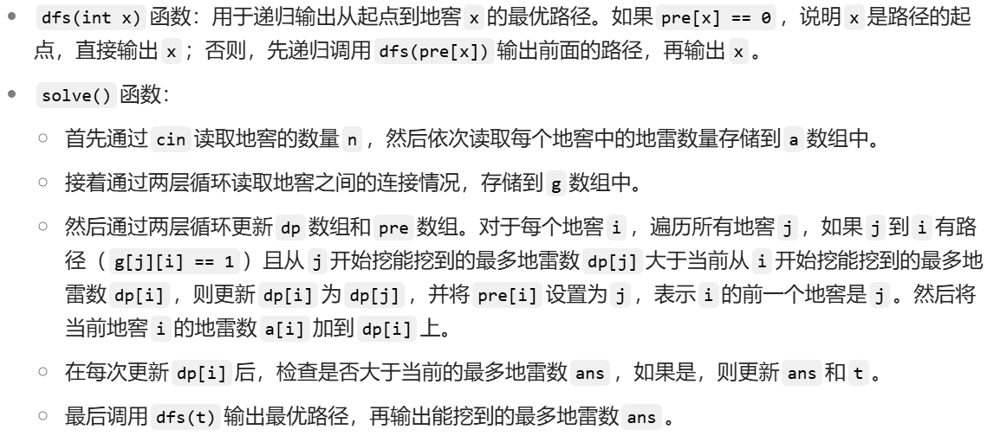
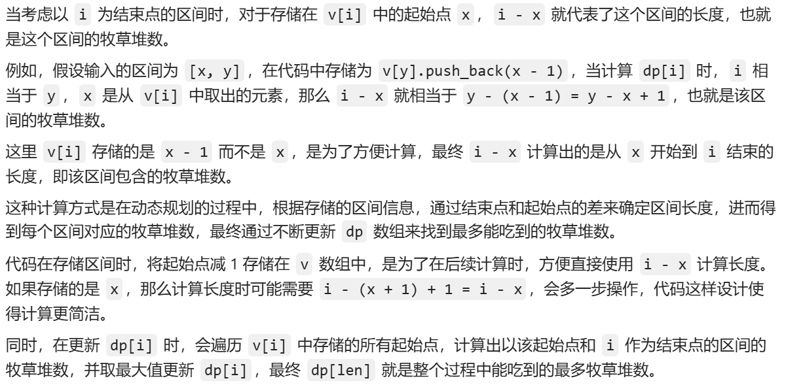
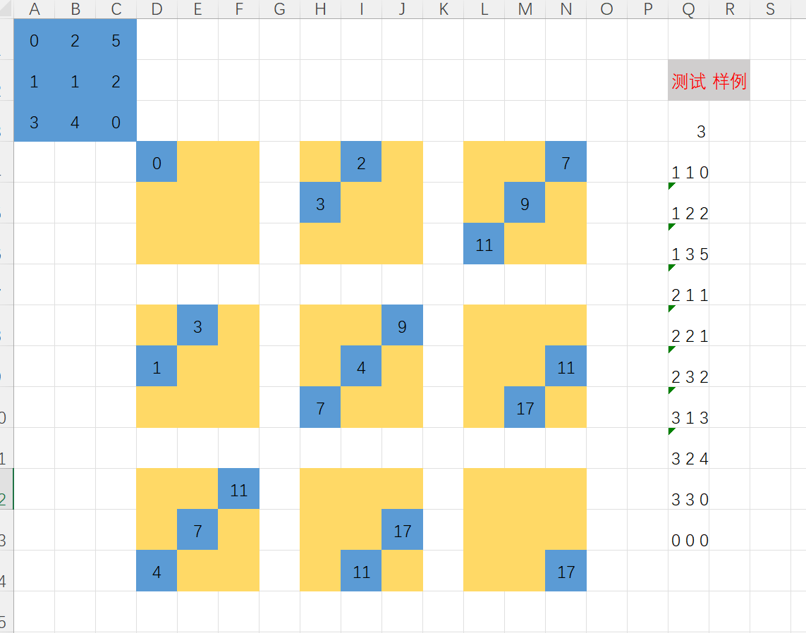
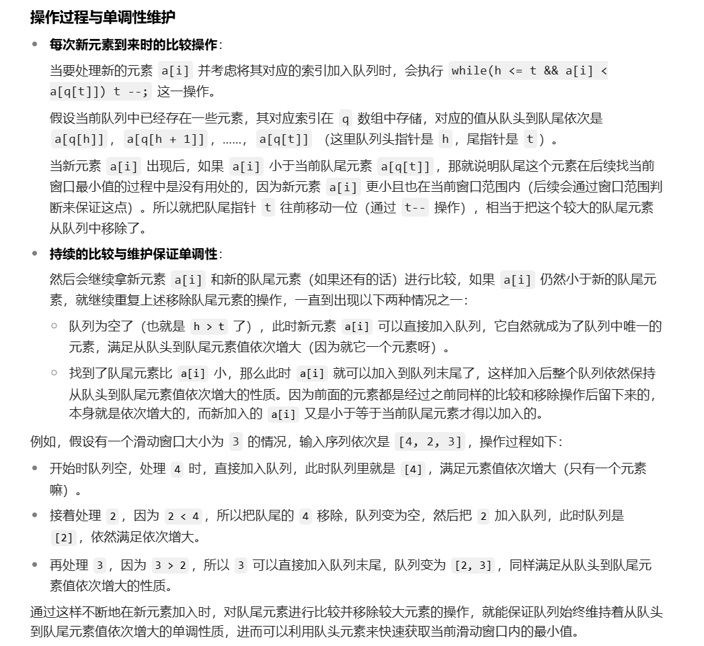
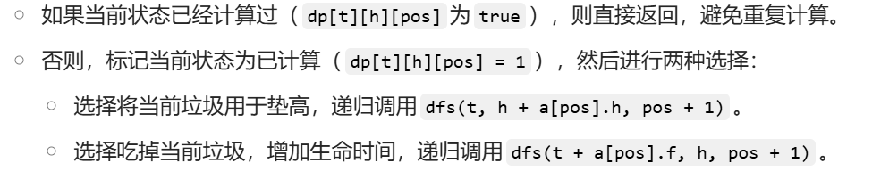

# 动态规划

## 常规DP

[过河卒]([P1002 [NOIP2002 普及组\] 过河卒 - 洛谷 | 计算机科学教育新生态](https://www.luogu.com.cn/problem/P1002))

```c
#include<bits/stdc++.h>
#define int long long
using namespace std;
const int N = 25;

int ans = 0;
int bx, by, hx, hy;
int g[N][N], dp[N][N];
int dx[] = {1, 0};
int dy[] = {0, 1};
int dhx[] = {1, 1, 2, 2, -1, -1, -2, -2};
int dhy[] = {2, -2, 1, -1, 2, -2, 1, -1};

bool check(int x, int y) {
    for(int i = 0; i < 8; i ++) {
        if(x == hx + dhx[i] && y == hy + dhy[i]) return true;
        if(x == hx && y == hy) return true;
    }
    return false;
}

void solve() {
	cin >> bx >> by >> hx >> hy;
	bx += 2, by += 2;
    hx += 2, hy += 2;
    // 全部坐标加2防止数组越界
    dp[2][2] = 1;
    
    for(int i = 2; i <= bx; i ++) {
    	for(int j = 2; j <= by; j ++) {
    		if(check(i, j) || (i == 2 && j == 2)) continue;
    		dp[i][j] = dp[i - 1][j] + dp[i][j - 1];
    	}
    }
    cout << dp[bx][by];
}

signed main() {
    ios::sync_with_stdio(false);
    cin.tie(0);
    cout.tie(0);
    c
    solve();
    return 0;
}
```

[摆花]([P1077 [NOIP2012 普及组\] 摆花 - 洛谷 | 计算机科学教育新生态](https://www.luogu.com.cn/problem/P1077#submit))

```
#include <bits/stdc++.h>
#define int long long
using namespace std;
const int N = 110;
const int mod = 1e6 + 7;

int n, m;
int a[N], dp[N][N];

void solve() {
    cin >> n >> m;
    for(int i = 1; i <= n; i ++) cin >> a[i];
    dp[0][0] = 1;
    for(int i = 1; i <= n; i ++) {
    	for(int j = 0; j <= m; j ++) {
    		for(int k = 0; k <= min(j, a[i]); k ++) {
    			dp[i][j] = (dp[i][j] + dp[i - 1][j - k]) % mod;
    		}
    	}
    }
    cout << dp[n][m] << endl;
}

signed main() {
    ios::sync_with_stdio(false);
    cin.tie(0);
    cout.tie(0);
    
    solve();
    return 0;
}
```

[守望者的逃离]([P1095 [NOIP2007 普及组\] 守望者的逃离 - 洛谷 | 计算机科学教育新生态](https://www.luogu.com.cn/problem/P1095))

```
#include <bits/stdc++.h>
#define int long long
using namespace std;

int m, s, t;

void solve() {
    cin >> m >> s >> t;
    int s1 = 0, s2 = 0;
    for(int i = 1; i <= t; i ++) {
    	s1 += 17;
    	if(m >= 10) {
    		s2 += 60;
    		m -= 10;
    	}
    	else m += 4;
    	s1 = max(s1, s2);
    	if(s1 > s) {
			cout << "Yes" << endl << i;
			return ;
		}
    }
	cout << "No" << endl << s1;
}

signed main() {
    ios::sync_with_stdio(false);
    cin.tie(0);
    cout.tie(0);
    
    solve();
    return 0;
}
```

[挖地雷]([P2196 [NOIP1996 提高组\] 挖地雷 - 洛谷 | 计算机科学教育新生态](https://www.luogu.com.cn/problem/P2196))

```
a[i]记录 i 位置地雷数
dp[i]记录以 i 节点结束的最大值
dp[i] = max{dp[i]} + a[i];
pre[i]存前驱节点
```

```
#include <bits/stdc++.h>
#define int long long
using namespace std;
const int N = 210;

int n, ans, t;
int a[N], g[N][N], pre[N], dp[N];

void dfs(int x) {
	if(pre[x] == 0) {
		cout << x << " ";
		return ;
	}
	dfs(pre[x]);
	cout << x << " ";
}

void solve() {
    cin >> n;
    for(int i = 1; i <= n; i ++) cin >> a[i];
    for(int i = 1; i < n; i ++) {
    	for(int j = i + 1; j <= n; j ++) {
    		cin >> g[i][j];
    	}
    }
    for(int i = 1; i <= n; i ++) {
    	for(int j = 1; j <= n; j ++) {
    		if(g[j][i] && dp[j] > dp[i]) {
    			dp[i] = dp[j];
    			pre[i] = j;
    		}
    	}
    	dp[i] += a[i];
    	if(dp[i] > ans) {
    		ans = dp[i];
    		t = i;
    	}
    }
    dfs(t);
    cout << endl << ans;
}

signed main() {
    ios::sync_with_stdio(false);
    cin.tie(0);
    cout.tie(0);
    
    solve();
    return 0;
}
```



[打鼹鼠]([P2285 [HNOI2004\] 打鼹鼠 - 洛谷 | 计算机科学教育新生态](https://www.luogu.com.cn/problem/P2285))

```
#include <bits/stdc++.h>
#define int long long
using namespace std;
const int N = 10010;

int n, m, ans = 0, dp[N];

struct node {
    int t, x, y;
}a[N];

int dist(int x1, int y1, int x2, int y2) {
    int dist = abs(x1 - x2) + abs(y1 - y2);
    return dist;
}

void solve() {
	cin >> n >> m;
    for(int i = 0; i < m; i ++) {
        cin >> a[i].t >> a[i].x >> a[i].y;
        dp[i] = 1;
    }

    for(int i = 0; i < m; i ++) {
        for(int j = 0; j < i; j ++) {
            int dis = dist(a[i].x, a[i].y, a[j].x, a[j].y);
            int deta = abs(a[i].t - a[j].t);
            if(deta >= dis) {
                dp[i] = max(dp[i], dp[j] + 1);
            }
        }
        ans = max(ans, dp[i]);
    }
    cout << ans << endl;
}

signed main() {
    ios::sync_with_stdio(false);
    cin.tie(0);
    cout.tie(0);
    
    solve();
    return 0;
}
```

[线段]([P3842 [TJOI2007\] 线段 - 洛谷 | 计算机科学教育新生态](https://www.luogu.com.cn/problem/P3842))

```
#include <bits/stdc++.h>
#define int long long
using namespace std;
const int N = 2e4 + 10;

int n, len[N], l[N], r[N], dp[N][2];

void solve() {
	cin >> n;
    for(int i = 1; i <= n; i ++) cin >> l[i] >> r[i];
    dp[1][0] = r[1] - l[1] + r[1] - 1;
    dp[1][1] = r[1] - 1;
    for(int i = 2; i <= n; i ++) {
        dp[i][0] = min(dp[i - 1][0] + abs(r[i] - l[i - 1]) + r[i] - l[i], dp[i - 1][1] + abs(r[i] - r[i - 1]) + r[i] - l[i]) + 1;
        dp[i][1] = min(dp[i - 1][0] + abs(l[i] - l[i - 1]) + r[i] - l[i], dp[i - 1][1] + abs(l[i] - r[i - 1]) + r[i] - l[i]) + 1;
    }
    cout << min(dp[n][0] + n - l[n], dp[n][1] + n - r[n]);
}

signed main() {
    ios::sync_with_stdio(false);
    cin.tie(0);
    cout.tie(0);
    
    solve();
    return 0;
}
```


## 线性DP

[滑雪(priority_queue)]([P1434 [SHOI2002\] 滑雪 - 洛谷 | 计算机科学教育新生态](https://www.luogu.com.cn/problem/P1434))

><font color=salmon>priority_queue 中的 cmp</font>
>
>###### 1.1 重载小于运算符
>
>```
>struct node {
>	int i, j, num;
>	bool operator<(const node &x) const {
>		return x.num < this->num;
>	}
>};
>```
>
>###### 1.2 自定义仿函数
>
>```
>struct cmp {
>	bool operator()(node x, node y) {
>		return x.num > y.num;
>	}
>}
>```

```
#include <bits/stdc++.h>
#define int long long
using namespace std;
const int N = 110;

typedef struct node {
	int i, j, num;
}node;

struct cmp {
    bool operator()(node x, node y) {
        return x.num > y.num;
    }
};

int n, m, ans = -0x3fff;
int dp[N][N], g[N][N];
priority_queue<node, vector<node>, cmp> q;

void solve() {
    cin >> n >> m;
	for(int i = 1; i <= n; i ++) {
		for(int j = 1; j <= m; j ++) {
			cin >> g[i][j];
			dp[i][j] = 1;
			node tmp;
			tmp.i = i, tmp.j = j, tmp.num = g[i][j];
			q.push(tmp);
		}
	}
	while(!q.empty()) {	
		auto it = q.top();
        q.pop();

		int i = it.i, j = it.j, num = it.num;
		if(g[i - 1][j] < num) dp[i][j] = max(dp[i][j], dp[i - 1][j] + 1);
        if(g[i + 1][j] < num) dp[i][j] = max(dp[i][j], dp[i + 1][j] + 1);
        if(g[i][j - 1] < num) dp[i][j] = max(dp[i][j], dp[i][j - 1] + 1);
        if(g[i][j + 1] < num) dp[i][j] = max(dp[i][j], dp[i][j + 1] + 1);

		ans = max(ans, dp[i][j]);
	}
	cout << ans << endl;
}

signed main() {
    ios::sync_with_stdio(false);
    cin.tie(0);
    cout.tie(0);
    
    solve();
    return 0;
}
```

[饥饿的奶牛]([P1868 饥饿的奶牛 - 洛谷 | 计算机科学教育新生态](https://www.luogu.com.cn/problem/P1868))

```
#include <bits/stdc++.h>
#define int long long
using namespace std;
const int N = 3e6 + 10;

int n, len, dp[N];
vector<int> v[N];

void solve() {
	cin >> n;
    for(int i = 1; i <= n; i ++) {
        int x, y;
        cin >> x >> y;
        v[y].push_back(x - 1);
        len = max(len, y);
    }
    for(int i = 1; i <= len; i ++) {
        dp[i] = dp[i - 1];
        for(int j = 0; j < v[i].size(); j ++) {
            int x = v[i][j];
            dp[i] = max(dp[i], dp[x] + i - x);
        }
    }
    cout << dp[len] << endl;
}

signed main() {
    ios::sync_with_stdio(false);
    cin.tie(0);
    cout.tie(0);
    
    solve();
    return 0;
}
```



[方格取数]([P1004 [NOIP2000 提高组\] 方格取数 - 洛谷 | 计算机科学教育新生态](https://www.luogu.com.cn/problem/P1004))



```
i 和 j 表示第一遍的行和列
k 和 l 表示第二遍的行和列
表格中大的方向上(大九宫格)表示第一次遍历的行列
九宫格内的行列表示第二次遍历的行列
每个蓝格子都可以由前四种状态转移过来
```

```
#include <bits/stdc++.h>
#define int long long
using namespace std;
const int N = 10;

int n, maxn, g[N][N], dp[N][N][N][N];

int unmax(int a, int b, int c, int d) {
    int x = max(a, b);
    int y = max(c, d);
    return max(x, y);
}

void solve() {
    int x, y, t;
	cin >> n;
    while(cin >> x >> y >> t && x) g[x][y] = t;
    for(int i = 1; i <= n; i ++) {
        for(int j = 1; j <= n; j ++) {
            for(int k = 1; k <= n; k ++) {
                for(int l = 1; l <= n; l ++) {
                    if(i + j == k + l) {
                        dp[i][j][k][l] = unmax(dp[i - 1][j][k - 1][l], dp[i - 1][j][k][l - 1], dp[i][j - 1][k - 1][l], dp[i][j - 1][k][l - 1]) + g[i][j] + g[k][l];
                        if(i == k && j == l) {
                            dp[i][j][k][l] -= g[i][j];
                            maxn = max(maxn, dp[i][j][k][l]);
                        }
                    }
                    // cout << dp[i][j][k][l] << " ";
                }
                // cout << endl;
            }
            // cout << "-----" << endl;
        }
    }
    cout << maxn << endl;
}

signed main() {
    ios::sync_with_stdio(false);
    cin.tie(0);
    cout.tie(0);
    
    solve();
    return 0;
}
```


### LIS问题

[导弹拦截(典题)]([P1020 [NOIP1999 提高组\] 导弹拦截 - 洛谷 | 计算机科学教育新生态](https://www.luogu.com.cn/problem/P1020))

```
样例:389 207 155 300 299 170 158 65
第一问: 最多拦截多少导弹
389 207 155 300 299 170 158 65
 1	 2   3   2   3   4   5  6
 即 389 300 299 170 158 65 (最长不上升子序列长度为6)
 
 第二问: 拦截所有导弹需要多少套系统
 389 207 155 158
 300 299 170 65
 只需记录最小即可(最少能被划分成多少个不上升子序列)
```

> 100分

```c++
#include <bits/stdc++.h>
#define int long long
using namespace std;
const int N = 100010;

int a[N], dp[N];
int ans1 = 0, ans2 = 0;

void solve() {
    int i = 0;
    while(cin >> a[i]) {
    	dp[i] = 1;
    	for(int j = 0; j < i; j ++) {
    		if(a[i] <= a[j]) {
    			dp[i] = max(dp[i], dp[j] + 1);
    		}
    	}
    	ans1 = max(ans1, dp[i]);
    	i ++;
    }
    
    int n = i - 1;
    for(int i = 0; i < n; i ++) dp[i] = 1;
    for(int i = 0; i < n; i ++) {
    	for(int j = 0; j < i; j ++) {
    		if(a[i] > a[j]) {
    			dp[i] = max(dp[i], dp[j] + 1);
    		}
    	}
    	ans2 = max(ans2, dp[i]);
    }
    cout << ans1 << endl << ans2 << endl;  
}

signed main() {
    ios::sync_with_stdio(false);
    cin.tie(0);
    cout.tie(0);
    
    solve();
    return 0;
}
```

#### 利用 DilworthDilworth 定理 优化

<font color=grey>说人话就是</font>

><font color=red>最长上升子序列长度 等价于 不上升序列个数</font>
>
><font color=blue>最长不上升序列长度 —> 最长上升子序列个数</font>
>
><font color=blue>最长上升序列长度 —> 最长不上升子序列个数</font>

> 200分

```
#include <bits/stdc++.h>
#define int long long
using namespace std;
const int N = 100010;

int a[N], b[N];
int cnta = 0, cntb = 0;

void solve() {
    int x;
    while(cin >> x) {
    	int st = 0;
    	for(int i = 0; i < cnta; i ++) {
    		if(x > a[i]) { // 实际求最长不上升子序列长度
    			a[i] = x;  // 等价于最长上升子序列个数
    			st = 1;
    			break;
    		}
    	}
    	if(st == 0) a[cnta ++] = x;
    	
    	st = 0;
    	for(int i = 0; i < cntb; i ++) {
    		if(b[i] >= x) { // 实际求最长不上升子序列个数
    			b[i] = x;
    			st = 1;
    			break;
    		}
    	}
    	if(st == 0) b[cntb ++] = x;
    }
    cout << cnta << endl << cntb;
}

signed main() {
    ios::sync_with_stdio(false);
    cin.tie(0);
    cout.tie(0);
    
    solve();
    return 0;
}
```

> 在遍历中使用二分优化，即满分答案
>
> 常规二分用手搓，用到二分函数时用STL
>
> <font color=blue>lower_bound 返回第一个 <font color=red>大于等于</font> x的元素的位置的迭代器</font>
>
> <font color=blue>upper_bound 返回第一个 <font color=red>大于</font> x的元素的位置的迭代器</font>

```
int i = lower_bound(a, a + n, x) - a;
int j = upper_bound(a, a + n, x) - a;

a[0] ~ a[i - 1] 为小于x的元素
a[i] ~ a[j - 1] 为等于x的元素
a[j] ~ a[n - 1] 为大于x的元素
```

```c++
#include <bits/stdc++.h>
#define int long long
using namespace std;
const int N = 100010;

int a[N], b[N]; // a 用于最长不上升子序列，b 用于最长上升子序列
int cnta = 0, cntb = 0; // 分别记录 a 和 b 的长度

// 在数组 a 中插入 x，维护最长不上升子序列
void insert_a(int x) {
    if (cnta == 0 || x <= a[cnta - 1]) {
        // 如果 x 小于等于 a 的最后一个元素，直接添加到末尾
        a[cnta++] = x;
    } else {
        // 否则，找到第一个小于 x 的位置，替换它
        int pos = upper_bound(a, a + cnta, x, greater<int>()) - a;
        a[pos] = x;
    }
}

// 在数组 b 中插入 x，维护最长上升子序列
void insert_b(int x) {
    if (cntb == 0 || x > b[cntb - 1]) {
        // 如果 x 大于 b 的最后一个元素，直接添加到末尾
        b[cntb++] = x;
    } else {
        // 否则，找到第一个大于等于 x 的位置，替换它
        int pos = lower_bound(b, b + cntb, x) - b;
        b[pos] = x;
    }
}

void solve() {
    int x;
    while (cin >> x) {
        insert_a(x); // 维护最长不上升子序列
        insert_b(x); // 维护最长上升子序列
    }
    cout << cnta << endl << cntb << endl;
    // 即最长不上升子序列的长度和最长上升子序列的个数
}

signed main() {
    ios::sync_with_stdio(false);
    cin.tie(0);
    cout.tie(0);

    solve();
    return 0;
}
```

[合唱队形]([P1091 [NOIP2004 提高组\] 合唱队形 - 洛谷 | 计算机科学教育新生态](https://www.luogu.com.cn/problem/P1091))

## DP优化

### 单调队列

(傻逼东西)

#### 单调队列优化具体步骤

- 加入所需元素：向单调队列重复加入元素直到当前元素达到所求区间的右边界，这样就能保证所需元素都在单调队列中。
- 弹出越界队首：单调队列本质上是维护的是所有已插入元素的最值，但我们想要的往往是一个区间最值。于是我们 <font color=red>弹出在左边界外的元素</font>，以保证单调队列中的元素都在所求区间中。
- 获取最值：直接取队首作为答案即可。

<font color=salmon>队列存的是对应元素下标</font>

[滑动窗口(模板)]([P1886 滑动窗口 /【模板】单调队列 - 洛谷 | 计算机科学教育新生态](https://www.luogu.com.cn/problem/P1886))

```
样例分析
8 3
1 3 -1 -3 5 3 6 7
1 [3, -1, -3] 5 3 6 7
   h	   t
```

> 队列模拟

```c++
#include <bits/stdc++.h>
#define int long long
using namespace std;
const int N = 1e6 + 10;

int n, k, a[N], q[N];

void solve1() {
    int h = 0, t = -1;
    cin >> n >> k;
    for(int i = 1; i <= n; i ++) cin >> a[i];
    for(int i = 1; i <= n; i ++) {
    	while(h <= t && i - k >= q[h]) h ++;
    	while(h <= t && a[i] < a[q[t]]) t --;
    	q[++ t] = i;
    	if(i >= k) cout << a[q[h]] << " ";
    }
    cout << endl;
}

void solve2() {
	int h = 0, t = -1;
	for(int i = 1; i <= n; i ++) {
		while(h <= t && i - k >= q[h]) h ++;
		while(h <= t && a[i] > a[q[t]]) t --;
		q[++ t] = i;
		if(i >= k) cout << a[q[h]] << " ";
	}
	cout << endl;
}

signed main() {
    ios::sync_with_stdio(false);
    cin.tie(0);
    cout.tie(0);
    
    solve1(); // min
	solve2(); // max
    return 0;
}
```

```
两个while循环解释(核心代码)

// 队列不为空且当前窗口已经滑过了队列头部所指向的元素对应的位置
while(h <= t && i - k >= q[h]) h ++;

(向前<-- 向后-->)
// 在保证队列非空的前提下，不断比较当前要加入窗口的元素a[i]和队尾元素对应的a[q[t]]的大小
// 如果当前元素更小，就将队列尾指针t向前移动(即移除队尾较大的元素)
// 从而保证队列中存储的索引对应的元素是单调递增的(从队头到队尾元素值依次增大)
// 这样队头元素始终是当前窗口内的最小值。
while(h <= t && a[i] < a[q[t]]) t --;

// 将当前元素的索引i加入到队列中(通过移动尾指针并赋值)
q[++ t] = i; 

// 是窗口已经填满了k个元素后,输出当前窗口内的最值
if(i >= k) cout << a[q[h]];
```



> STL队列单调队列

```c++
#include <bits/stdc++.h>
#define int long long
using namespace std;
const int N = 1e6 + 10;

int n, k, a[N];
deque<int> q;

void solve1() {
    cin >> n >> k;
    for(int i = 1; i <= n; i ++) cin >> a[i];
    for(int i = 1; i <= n; i ++) {
    	while(!q.empty() && i - k >= q.front()) q.pop_front();
		while(!q.empty() && a[i] < a[q.back()]) q.pop_back();
		q.push_back(i);
		if(i >= k) cout << a[q.front()] << " ";
    }
	cout << endl;
}

void solve2() {
	q.clear();
	for(int i = 1; i <= n; i ++) {
		while(!q.empty() && i - k >= q.front()) q.pop_front();
		while(!q.empty() && a[i] > a[q.back()]) q.pop_back();
		q.push_back(i);
		if(i >= k) cout << a[q.front()] << " ";
	}
	cout << endl;
}

signed main() {
    ios::sync_with_stdio(false);
    cin.tie(0);
    cout.tie(0);
    
    solve1();
    solve2();
    return 0;
}
```


[琪露诺]([P1725 琪露诺 - 洛谷 | 计算机科学教育新生态](https://www.luogu.com.cn/problem/P1725))

```
样例分析:
5 2 3
0  12  3 11 7 -2 0 0 0...
11 23 10 11
```

> 未优化80分

```
#include<bits/stdc++.h>
#define int long long
using namespace std;
const int N = 2e5 + 10;

int n, l, r, a[N];

void solve() {
    cin >> n >> l >> r;
    for(int i = 0; i <= n; i ++) cin >> a[i];
    for(int i = n - l; i >= 0; i --) {
        int k = -1e9;
        for(int j = l; j <= r; j ++) {
            k = max(k, a[i + j]);
        }
        a[i] += k;
    }
    cout << a[0] << endl;
}

signed main() {
    ios::sync_with_stdio(false);
    cin.tie(0);
    cout.tie(0);
    solve();
    return 0;
}
```

> 滑动窗口优化

```
#include<bits/stdc++.h>
#define int long long
using namespace std;
const int N = 3e5;

int n, l, r, a[N];
deque<int> q;

void solve() {
    cin >> n >> l >> r;
    for(int i = 0; i <= n; i ++) cin >> a[i];

    q.push_back(n + 1);
    for(int i = n - l; i >= 0; i --) {
        while(!q.empty() && q.front() > i + r) q.pop_front();
        while(!q.empty() && a[i + l] > a[q.back()]) q.pop_back();
        q.push_back(i + l);
        a[i] += a[q.front()];
    }
    cout << a[0] << endl;
}

signed main() {
    ios::sync_with_stdio(false);
    cin.tie(0);
    cout.tie(0);
    solve();
    return 0;
}
```

```
#include<bits/stdc++.h>
#define int long long
using namespace std;
const int N = 3e5;

int n, l, r, a[N], q[N];
int h = 0, t = 0;

void solve() {
    cin >> n >> l >> r;
    for(int i = 0; i <= n; i ++) cin >> a[i];

    q[t ++] = n + 1;
    for(int i = n - l; i >= 0; i --) {
        while(h < t && q[h] > i + r) h ++;
        while(h < t && a[i + l] > a[q[t - 1]]) t --;
        q[t ++] = i + l;
        a[i] += a[q[h]];
    }
    cout << a[0] << endl;
}

signed main() {
    ios::sync_with_stdio(false);
    cin.tie(0);
    cout.tie(0);
    solve();
    return 0;
}
```


## 背包问题

[装箱问题]([P1049 [NOIP2001 普及组\] 装箱问题 - 洛谷 | 计算机科学教育新生态](https://www.luogu.com.cn/problem/P1049))

```
#include <bits/stdc++.h>
#define int long long
using namespace std;
const int N = 20010;

int v, n, vol[N], dp[N][N];

void solve() {
	cin >> v >> n;
	for(int i = 1; i <= n; i ++) cin >> vol[i];
	for(int i = 1; i <= n; i ++) {
		for(int j = 1; j <= v; j ++) {
			dp[i][j] = dp[i - 1][j];
			if(j >= vol[i]) {
				dp[i][j] = max(dp[i - 1][j - vol[i]] + vol[i], dp[i - 1][j]);
			}
		}
	}
	cout << v - dp[n][v] << endl;
}

signed main() {
    ios::sync_with_stdio(false);
    cin.tie(0);
    cout.tie(0);
    
    solve();
    return 0;
}
```


[乌龟棋]([P1541 [NOIP2010 提高组\] 乌龟棋 - 洛谷 | 计算机科学教育新生态](https://www.luogu.com.cn/problem/P1541))

```
#include<bits/stdc++.h>
#define int long long
using namespace std;

int n, m;
int t[360], r[5], dp[41][41][41][41];

void solve() {
    cin >> n >> m;
    for(int i = 1; i <= n; i ++) cin >> t[i];
    for(int i = 1; i <= m; i ++) {
        int k;
        cin >> k;
        r[k] ++;
    }
    dp[0][0][0][0] = t[1];
    for(int a = 0; a <= r[1]; a ++) {
        for(int b = 0; b <= r[2]; b ++) {
            for(int c = 0; c <= r[3]; c ++) {
                for(int d = 0; d <= r[4]; d ++) {
                    int st = 1 + a + b * 2 + c * 3 + d * 4;
                    if(a != 0) dp[a][b][c][d] = max(dp[a][b][c][d], dp[a-1][b][c][d] + t[st]);
                    if(b != 0) dp[a][b][c][d] = max(dp[a][b][c][d], dp[a][b-1][c][d] + t[st]);
                    if(c != 0) dp[a][b][c][d] = max(dp[a][b][c][d], dp[a][b][c-1][d] + t[st]);
                    if(d != 0) dp[a][b][c][d] = max(dp[a][b][c][d], dp[a][b][c][d-1] + t[st]);
                }
            }
        }
    }
    cout << dp[r[1]][r[2]][r[3]][r[4]];
}

signed main() {
    ios::sync_with_stdio(false);
    cin.tie(0);
    cout.tie(0);
    solve();
    return 0;
}
```


### 背包问题变种

[金明的预算方案]([P1064 [NOIP2006 提高组\] 金明的预算方案 - 洛谷 | 计算机科学教育新生态](https://www.luogu.com.cn/problem/P1064))

```
思路：
复杂背包问题，常规背包两个状态 选和不选
此问题的状态为：
1.选主件(无配件)
2.选主件 + 1号配件
3.选主件 + 2号配件
4.选主件 + 1，2号配件
```

```
#include<bits/stdc++.h>
#define int long long
using namespace std;
const int N = 32010;

int n, m;
int dp[N], f[N];

struct node {
    int id, v, e, f;
}num[N];

bool cmp(node x, node y) {
    if(x.id == y.id) return x.f < y.f;
    return x.id < y.id;
}

void solve() {
    int val, bulk, imp;
	cin >> n >> m;
    for(int i = 1; i <= m; i ++) {
        cin >> val >> imp >> bulk;
        if(bulk == 0) {
            num[i].id = i;
            num[i].v = val;
            num[i].e = val * imp;
            num[i].f = 0;
        }
        else {
            num[i].id = bulk;
            num[i].v = val;
            num[i].e = val * imp;
            num[i].f = ++ f[bulk];
        }
    }
    sort(num + 1, num + 1 + m, cmp);
    for(int i = 1; i <= m; i ++) {
        if(num[i].f) continue;
        for(int j = n; j >= num[i].v; j --) {
            dp[j] = max(dp[j], dp[j - num[i].v] + num[i].e);
            if(num[i + 1].id == num[i].id && j >= num[i].v + num[i + 1].v) {
                dp[j] = max(dp[j], dp[j - num[i].v - num[i + 1].v] + num[i].e + num[i + 1].e);
            }
            if(num[i + 2].id == num[i].id && j >= num[i].v + num[i + 2].v) {
                dp[j] = max(dp[j], dp[j - num[i].v - num[i + 2].v] + num[i].e + num[i + 2].e);
            }
            if(num[i + 2].id == num[i].id && j >= num[i].v + num[i + 1].v + num[i + 2].v) {
                dp[j] = max(dp[j], dp[j - num[i].v - num[i + 1].v - num[i + 2].v] + num[i].e + num[i + 1].e + num[i + 2].e);
            }
        }
    }
    cout << dp[n] << endl;
}

signed main() {
    ios::sync_with_stdio(false);
    cin.tie(0);
    cout.tie(0);
    solve();
    return 0;
}
```

## 记忆化搜索

[垃圾陷阱]([P1156 垃圾陷阱 - 洛谷 | 计算机科学教育新生态](https://www.luogu.com.cn/problem/P1156))

```
状态:吃还是垫脚
开三维dp会re一个点
三维map记忆化搜索处理离散化数据
```



```c
#include <bits/stdc++.h>
#define int long long
using namespace std;

int n, m;
int a1 = 0x3fff, a2 = 0;
map<int, map<int, map<int, bool> > > dp;

struct node {
    int t, f, h;
}a[105];

bool cmp(node x, node y) {
    return x.t < y.t;
}

void dfs(int t, int h, int pos) {
    if(h >= n) {
        a1 = min(a1, a[pos - 1].t);
        return ;
    }
    if(pos > m || t < a[pos].t) {
        a2 = max(a2, t);
        return ;
    }
    if(dp[t][h][pos]) return ;
    dp[t][h][pos] = 1;
    dfs(t, h + a[pos].h, pos + 1);
    dfs(t + a[pos].f, h, pos + 1);
}

void solve() {
    cin >> n >> m;
    for(int i = 1; i <= m; i ++) {
        cin >> a[i].t >> a[i].f >> a[i].h;
    }
    sort(a + 1, a + 1 + m, cmp);
    dfs(10, 0, 1);
    if(a1 == 0x3fff) cout << a2 << endl;
    else cout << a1 << endl;
}

signed main() {
    ios::sync_with_stdio(false);
    cin.tie(0);
    cout.tie(0);
    solve();
    return 0;
}
```

[滑雪]([记录详情 - 洛谷 | 计算机科学教育新生态](https://www.luogu.com.cn/record/191610987))

```c
#include <bits/stdc++.h>
#define int long long
using namespace std;
const int N = 110;

int n, m, ans = -0x3fff;
int g[N][N], mem[N][N];
int dx[] = {1, -1, 0, 0};
int dy[] = {0, 0, 1, -1};

int dfs(int x, int y) {
	if(mem[x][y]) return mem[x][y];
	mem[x][y] = 1;
	
	for(int i = 0; i < 4 ; i ++) {
		int a = x + dx[i];
		int b = y + dy[i];
		
		if(a <= 0 || b <= 0 || a > n || b > m) continue;
		if(g[a][b] < g[x][y]) {
			dfs(a, b);
			mem[x][y] = max(mem[x][y], mem[a][b] + 1);
		}
	}
	return mem[x][y];
}

void solve() {
    cin >> n >> m;
    for(int i = 1; i <= n; i ++) {
    	for(int j = 1; j <= m; j ++) {
    		cin >> g[i][j];
    	}
    }
    for(int i = 1; i <= n; i ++) {
    	for(int j = 1; j <= m; j ++) {
    		ans = max(ans, dfs(i, j));
    	}
    }
    cout << ans << endl;
}

signed main() {
    ios::sync_with_stdio(false);
    cin.tie(0);
    cout.tie(0);
    
    solve();
    return 0;
}
```


## 状压DP


[互不侵犯](https://www.luogu.com.cn/problem/P1896)

```c
#include <bits/stdc++.h>
#define int long long
using namespace std;

int n, k;
int f[10][1<<10][85];
int ans;

int c(int st) {
    int cnt = 0;
    while(st) {
        cnt += st & 1;
        st /= 2;
    }
    return cnt;
}

bool check1(int st) {
    for(int i = 0; i + 1 < n; i ++) {
        if((st & (1<<i)) && (st & (1<<(1+i)))) {
            return false;
        }
    }
    return true;
}

bool check2(int st, int st2) {
    for(int i = 0; i < n; i ++) {
        if(st & (1<<i)) {
            if(st2 & (1<<i)) return false;
            if(st2 & (1<<(i+1)) && i + 1 < n) return false;
            if(st2 & (1<<(i-1)) && i - 1 >= 0) return false;
        }
    }
    return true;
}

void solve() {
    cin >> n >> k;
    for(int i = 1; i <= n; i ++) {
        for(int st = 0; st < (1<<n); st ++) {
            if(!check1(st)) continue;
            if(i == 1) f[i][st][c(st)] = 1;
            for(int j = c(st); j <= k; j ++) {
                for(int st2 = 0; st2 < (1<<n); st2 ++) {
                    if(!check1(st2) || !check2(st, st2)) continue;
                    f[i][st][j] += f[i - 1][st2][j - c(st)];
                }
            }
        }
    }
    for(int st = 0; st < (1<<n); st ++) {
        ans += f[n][st][k];
    }
    cout << ans << "\n";
}

signed main() {
    ios::sync_with_stdio(false);
    cin.tie(0);
    cout.tie(0);
    
    solve();
    return 0;
}
```


[骑士]()

```
n * n 的网格防止k个国王,每个国王周围八个格子不能放置其它国王,求方案数
```

```c++
#include<bits/stdc++.h>
using namespace std;
const int N = 12, M = 1<<10, K = 110;

typedef long long ll;
ll f[N][K][M];
int n, m;
vector<int> states;
vector<int> heads[M];
int id[M], cnt[M];

int cal_cnt(int st) {
    int res = 0;
    for(int i = 0; i < n; i ++ )
        if(st >> i & 1) res ++;
    return res;
}

bool check(int st) {
    for(int i = 0; i < n; i ++ )
        if((st >> i & 1) && (st >> (i + 1) & 1)) return 0;
    return 1;
}

void solve() {
    cin >> n >> m;

    for(int st = 0; st < (1<<n); st ++ )
        if(check(st)) {
            states.push_back(st);
            cnt[st] = cal_cnt(st);
            id[st] = states.size() - 1;
        }
    
    for(int i = 0; i < states.size(); i ++ ) // 上一行
        for(int j = 0; j < states.size(); j ++ ) { // 当前行
            int a = states[i], b = states[j];
            if(check(a | b) && (a & b) == 0)
                heads[i].push_back(j); // 存状态索引
        }
        
    f[0][0][0] = 1;
    for(int i = 1; i <= n + 1; i ++ ) // 枚举行数
        for(int j = 0; j <= m; j ++ ) // 枚举国王数
            for(int a_i = 0; a_i < states.size(); a_i ++ ) // 枚举当前行
                for(auto &b : heads[a_i]) {
                    int c = cnt[states[a_i]];
                    if(j >= c)
                        f[i][j][a_i] += f[i - 1][j - c][b];
                } 
    
    cout << f[n + 1][m][0] << "\n";            
}

int main() {
    ios::sync_with_stdio(0);
    cin.tie(0);
    cout.tie(0);
    solve();
    return 0;
}
```

```
intput:
3 2
output:
16
```

```
9 12
50734210126
```


## 状态机

[设计密码]()

```
设计密码S, 满足:
1. S的长度是N
2. S只包含小写字母
3. S不包含字串T
求有多少种方案满足，答案取模1e9+7
input:S的长度和字串T
1 <= N <= 50
1 < T <= N
```

```c++
intput:
2
a
output:
625
```

```
4
cbc
456924
```

```c++
#include<bits/stdc++.h>
using namespace std;
const int N = 55, mod = 1e9 + 7;

int n;
int ne[N];
string str;
int f[N][N];

void solve() {
    cin >> n >> str;
    int m = str.size();
    str = ' ' + str;

    for(int i = 2, j = 0; i <= m; i ++ ) {
        while(j && str[i] != str[j + 1]) j = ne[j];
        if(str[i] == str[j + 1]) j ++;
        ne[i] = j;
    }

    f[0][0] = 1;
    for(int i = 0; i < n; i ++ )
        for(int j = 0; j < m; j ++ )
            for(char k = 'a'; k <= 'z'; k ++ ) {
                int c = j;
                while(c && k != str[c + 1]) c = ne[c];
                if(k == str[c + 1]) c ++;
                f[i + 1][c] = (f[i][j] + f[i + 1][j]) % mod;
            }
    
    int res = 0;
    for(int j = 0; j < m; j ++ )
        res = (res + f[n][j]) % mod;
    cout << res << "\n";
}

int main() {
    ios::sync_with_stdio(0);
    cin.tie(0);
    cout.tie(0);
    solve();
    return 0;
}
```

