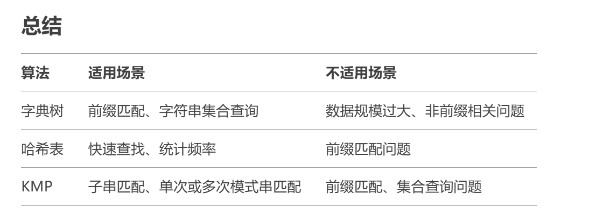
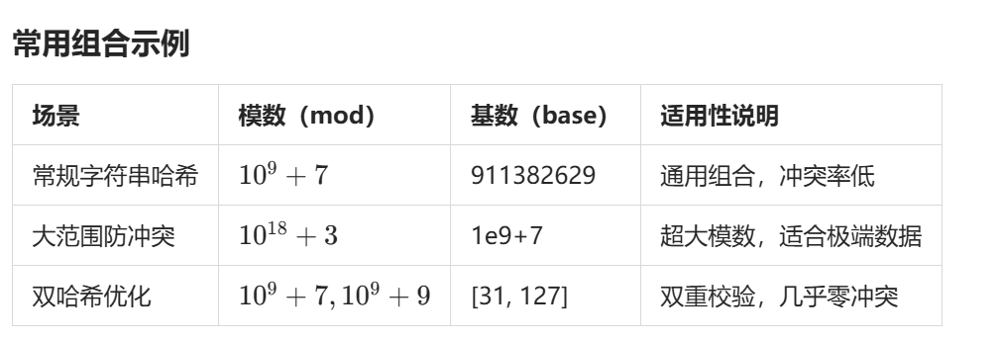
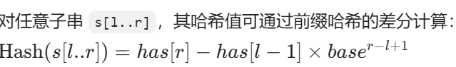
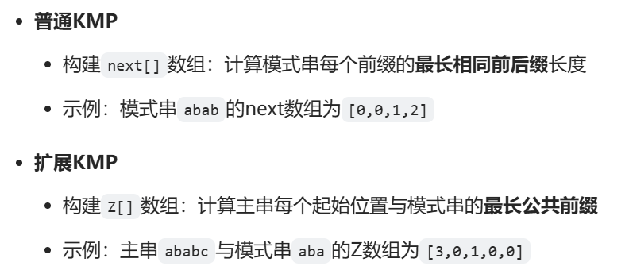
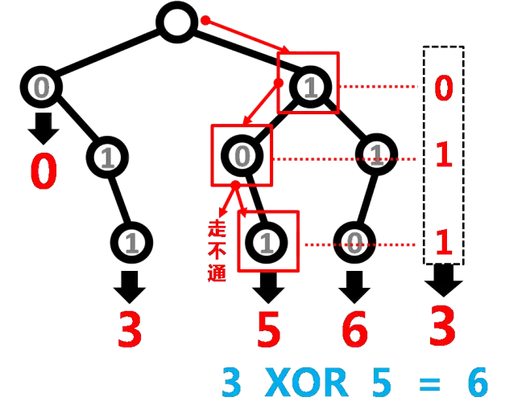

# 哈希表



[字符串哈希(模板)]([P3370 【模板】字符串哈希 - 洛谷 | 计算机科学教育新生态](https://www.luogu.com.cn/problem/P3370))

```
哈希码
进制:通常用 131 进制(131 为比128大的质数，生成哈希码重复概率小)
s = (s * 131 + s[i]) % mod
```

```
生成校验码mod函数
#define int long long
void calhash() {
	int a = 0x3ffffffffffffffff; // ull最大值(1个f表示4个字节)
	a = a / 131 - 131;
	while(1) {
		int st = 0;
		for(int i = 2; i * i <= a; i ++) {
			if(a % i == 0) {
				st = 0;
				break;
			}
		}
		if(st == 0) {
			cout << a << endl;
			return ;
		}
	}
}
```

```c++
#include <bits/stdc++.h>
#define int long long
using namespace std;

int n, res, a[1010];

int unhash(string s) {
    int code = 0, mod = 140814840257324689;
    for(int i = 1; i <= s.size(); i ++) {
        code = (code * 131 + (int)s[i]) % mod;
    }
    return code;
}

void solve() {
	cin >> n;
    for(int i = 0; i < n; i ++) {
        string s;
        cin >> s;
        a[i] = unhash(s);
    }
    sort(a, a + n);
    res = unique(a, a + n) - a;
    cout << res << endl;
}

signed main() {
    ios::sync_with_stdio(false);
    cin.tie(0);
    cout.tie(0);
    
    solve();
    return 0;
}
```

[Cities and States S]([P3405 [USACO16DEC\] Cities and States S - 洛谷 | 计算机科学教育新生态](https://www.luogu.com.cn/problem/P3405))

```c++
#include <bits/stdc++.h>
#define int long long
using namespace std;

int n, res = 0;
map<int, map<int, int> > v;

int unhash(string s) {
    int code = 0;
    for(int i = 0; i < 2; i ++) {
        code = code * 26 + (s[i] - 'A');
    }
    return code;
}

void solve() {
	cin >> n;
    for(int i = 1; i <= n; i ++) {
        int x, y;
        string a, b;
        cin >> a >> b;
        x = unhash(a);
        y = unhash(b);

        if(x == y) continue;
        v[x][y] ++;
        res += v[y][x];
    }
    cout << res << endl;
}

signed main() {
    ios::sync_with_stdio(false);
    cin.tie(0);
    cout.tie(0);
    
    solve();
    return 0;
}
```

[判断子串](https://12345code.com/problem.php?id=1847)

```c++
#include <bits/stdc++.h>
#define int long long
using namespace std;

int unpow(int len) {
    int x = 1;
    for(int i = 1; i <= len; i ++) {
        x *= 131;
    }
    return x;
}

int unhash(string s) {
    int l = s.size();
    int code = 0;
    for(int i = 0; i < l; i ++) {
        code = code * 131 + s[i];
    }
    return code;
}

void solve() {
	string s1, s2;
    getline(cin, s1);
    getline(cin, s2);
    int l1 = s1.size();
    int l2 = s2.size();

    int hs1[100010], hs2, hs, cal;
    cal = unpow(l2);
    hs2 = unhash(s2);

    hs1[0] = hs1[0] * 131 + s1[0];
    for(int i = 1; i < l1; i ++) {
        hs1[i] = hs1[i - 1] * 131 + s1[i];
    }
    if(hs2 == hs1[l2 - 1]) {
        cout << "YES" << endl;
        return ;
    }
    for(int i = 0; i < l1 - l2; i ++) {
        hs = hs1[i + l2] - hs1[i] * cal;
        if(hs == hs2) {
            cout << "YES" << endl;
            return ;
        }
    }
    cout << "NO" << endl;
}

signed main() {
    ios::sync_with_stdio(false);
    cin.tie(0);
    cout.tie(0);
    
    solve();
    return 0;
}
```


## 多次询问字串哈希

<font color=salmon>预处理出每个前缀哈希值，将哈希值看成一个b进制的数对M取模的结果</font>

> 适用: 滑动窗口、循环同构判断

```c
// 暴力匹配
长度为L的字符串T，预处理O(L方)
对每个字串逐字符计算哈希，单次查询O(M*L) // M为查询字符串长度
```

[白兔的字符串](https://ac.nowcoder.com/acm/problem/15253)

> STL暴力匹配

```c++
#include <bits/stdc++.h>
#define int long long
using namespace std;
const int mod = 1e9 + 7;
const int base = 911382629;

string t;
set<int> vis;

int unhash(string s) {
    int code = 0;
    for(int i = 0; i < s.size(); i ++) {
        code = (code * base + (s[i] - 'a')) % mod;
    }
    return code;
}

void solve() {
    int n;
    cin >> t >> n;
    string s = t + t;
    int len = t.size();
    for(int i = 0; i < len; i ++) {
        string ts = s.substr(i, len);
        vis.insert(unhash(ts));
    }
    
    while(n --) {
        string ss;
        cin >> ss;
        int cnt = 0;
        int ss_len = ss.size();

        if(ss_len < len) {
            cout << "0\n"; 
        }

        for(int i = 0; i <= ss_len - len; i ++) {
            string tss = ss.substr(i, len);
            int x = unhash(tss);
            if(vis.count(x)) cnt ++;
        }
        cout << cnt << "\n";
    }
}

signed main() {
    ios::sync_with_stdio(false);
    cin.tie(0);
    cout.tie(0);
    
    solve();
    return 0;
}
```

> 前缀哈希优化



```c
#include <bits/stdc++.h>
#define int long long
using namespace std;
const int mod = 1e5 + 7;
const int base = 131;
const int N = 2e6 + 10;

struct node {
    int to; 	// 存储哈希值
    int next; 	// 链表指针
} rode[N];
int head[mod], cnt;

string t;
int h[N], has[N]; 	// h[]表示位数进制，has[]表示前缀哈希数组

void add(int u) {
    int x = u % mod; 	// 计算哈希索引
    rode[++ cnt] = {u, head[x]};
    head[x] = cnt;
}
int unfind(int u) {
    int x = u % mod;
    for(int i = head[x]; i; i = rode[i].next) {
        if(rode[i].to == u) {
            return 1;
        }
    }
    return 0;
}

void solve() {
	cin >> t;
    string tt = ' ' + t + t; 	// 拆环为链
    t = ' ' + t;
    int L = t.size() - 1;
    
    h[0] = 1;
    for(int i = 1; i <= 2 * L; i ++) {
        h[i] = h[i - 1] * base; 	//  计算位数进制
    }
    for(int i = 1; i <= 2 * L; i ++) {
        has[i] = has[i - 1] * base + tt[i]; 	// 计算前缀哈希
        if(i >= L) {
            add(has[i] - has[i - L] * h[L]); 	// 插入哈希表
        }
    }
    
    int p;
    cin >> p;
    while(p --) {
        int ans = 0;
        string s;
        cin >> s;
        s = ' ' + s;
        int s_L = s.size() - 1;
        
        for(int i = 1; i <= s_L; i ++) {
            has[i] = has[i - 1] * base + s[i];
            if(i >= L) {
                ans += unfind(has[i] - has[i - L] * h[L]);
            }
        }
        cout << ans << endl;
    }
}

signed main() {
    ios::sync_with_stdio(false);
    cin.tie(0);
    cout.tie(0);
    
    solve();
    return 0;
}
```


# KMP算法

(傻逼东西)

<font color=salmon>模板</font>

[KMP]([P3375 【模板】KMP - 洛谷](https://www.luogu.com.cn/problem/P3375))

```c++
int kmp[N];
char a[N], b[N];

cin >> (a + 1) >> (b + 1);
int la = strlen(a + 1);
int lb = strlen(b + 1);
```

```c++
#include <bits/stdc++.h>
#define int long long
using namespace std;

int kmp[N];
string a, b; 	// a: 文本串, b: 模式串

void solve() {
	cin >> a >> b; // 从下标1开始存储
    int la = a.size();
    int lb = b.size();
    a = '0' + a;
    b = '0' + b;
    // 构建kmp数组
    int j = 0; // 前缀指针
    for(int i = 2; i <= lb; i ++) {
        while(j > 0 && b[i] != b[j + 1]) {
            j = kmp[j]; // 回退到前一个匹配位置
        }
        if(b[i] == b[j + 1]) {
            j ++; // 匹配成功，指针后移
        }
        kmp[i] = j;
    }
    // 匹配过程
    j = 0; // 重置模式串指针
    for(int i = 1; i <= la; i ++) {
        while(j > 0 && a[i] != b[j + 1]) {
            j = kmp[j]; // 回退
        }
        if(a[i] == b[j + 1]) {
            j ++; // 匹配成功
        }
        if(j == lb) {
            cout << i - lb + 1 << endl; // 输出匹配位置
            j = kmp[j]; // 继续查找下一个匹配
        }
    }
    // 输出每个前缀的最长border长度
    for(int i = 1; i <= lb; i ++) {
        cout << kmp[i] << " ";
    }
}

signed main() {
    ios::sync_with_stdio(false);
    cin.tie(0);
    cout.tie(0);
    
    solve();
    return 0;
}
```

[无线传输]([P4391 [BalticOI 2009\] Radio Transmission 无线传输 - 洛谷](https://www.luogu.com.cn/problem/P4391))

如果字符串 s*s* 是由某个子串 t*t* 重复多次连接而成的，那么前缀函数的最后一个值 π[n−1] 和字符串长度 n 之间有以下关系：

- 字符串 t*t* 的长度为 n − π[n−1]

```c++
#include <bits/stdc++.h>
#define int long long
using namespace std;
const int N = 1e6 + 10;

int n, kmp[N];
char b[N];

void solve() {
    cin >> n >> (b + 1);

    int j = 0;
    for(int i = 2; i <= n; i ++) {
        while(j > 0 && b[i] != b[j + 1]) {
            j = kmp[j];
        }
        if(b[i] == b[j + 1]) {
            j ++;
        }
        kmp[i] = j;
    }
    cout << n - kmp[n] << endl;
}

signed main() {
    ios::sync_with_stdio(false);
    cin.tie(0);
    cout.tie(0);
    
    solve();
    return 0;
}
```


### 拓展KMP(Z函数)

> 从文本串s某一位出发，最多能匹配模式串p中多少个字符串
>
> 以线性时间复杂度求出一个字符串s和它任意后缀的最长公共前缀长度
>
> 定义Z[1] = 0， 从 2~n 枚举 i， 依次计算Z[i]


>分析:
>
>1.假设在计算第 **i** 位的值 **Z[i]**, 此时 **z[1] ... z[i - 1]** 已经计算好了
>
>2.则对于任意的 **j** （j  < i）有 **s[j]..s[j + z[j] - 1] = s[1] … s[z[j]]**
>
>即从 **s[1]** 开始长度为 **z[j]** 的字符串等于从 **s[j]** 开始长度为 **z[j]** 的字符串
>
>3.为了计算z[i], 在枚举 i 的过程中，我们需要维护一个 R 最大的区间 [L, R]
>
>​		**L = j**		**R = j + z[j] - 1**
>
>初始时候 **L = 1, R = 0**


- **i <= R**

	- **z[i - L] < R - i + 1**

		则 **z[i] = z[i - L]**

		即从**i** 开始无法匹配到 **R** 这么远

	- **z[i - L] >= R - i + 1**

		令 **z[i] = R - i + 1** ， 继续暴力匹配

- **i > R**

	直接暴力匹配，令**z[i] = 0**, 然后暴力匹配

<font color=salmon>可以将 i <= R 两种情况讨论合并讨论</font>

- 令 z[i] = min(z[k], R - i + 1), 其中 k = i - L + 1
- 然后继续暴力匹配


<font color=salmon>模板</font>

```c
void exkmp(string s) {
    int n = s.size();
    s = ' ' + s;
    z[1] = n;
    int l = 1, r = 0;
    for(int i = 2; i <= n; i ++) {
        if(i > r) 
            z[i] = 0;
        else
            z[i] = min(z[i - l + 1], r - i + 1);
        while(i + z[i] <= n && s[1 + z[i]] == s[i + z[i]])
            z[i] ++;
        if(i + z[i] - 1> r) {
            l = i;
            r = i + z[i] - 1;
        }
    }
}
```


[扩展 KMP/exKMP](https://www.luogu.com.cn/problem/P5410)

```c
#include <bits/stdc++.h>
#define int long long
using namespace std;
const int N = 2e7 + 10;

string a, b;
int z[N], p[N];

int get(int *x, int len) {
    int ans = x[1] + 1;
    for(int i = 2; i <= len; i ++) {
        int k = (x[i] + 1) * i;
        ans = ans ^ k;
    }
    return ans;
}

void exkmp1(string s) {
    int n = s.size();
    s = ' ' + s;
    z[1] = n;
    int l = 1, r = 0;
    for(int i = 2; i <= n; i ++) {
        if(i > r) 
            z[i] = 0;
        else
            z[i] = min(z[i - l + 1], r - i + 1);
        while(i + z[i] <= n && s[1 + z[i]] == s[i + z[i]])
            z[i] ++;
        if(i + z[i] - 1 > r) {
            l = i;
            r = i + z[i] - 1;
        }
    }
}

void exkmp2(string s, string t) {
    int n = s.size();
    int m = t.size();
    s = ' ' + s;
    t = ' ' + t;

    p[1] = 0;
    while(1 + p[1] <= n && 1 + p[1] <= m &&
        t[1 + p[1]] == s[1 + p[1]]) 
        p[1] ++;
    
    int l = 1, r = p[1];
    for(int i = 2; i <= n; i ++) {
        if(i > r) 
            p[i] = 0;
        else
            p[i] = min(z[i - l + 1], r - i + 1);
        while(i + p[i] <= n && 1 + p[i] <= m &&
            s[i + p[i]] == t[1 + p[i]])
            p[i] ++;
        if(i + p[i] - 1 > r) {
            l = i;
            r = i + p[i] - 1;
        }
    }
}

void solve() {
	cin >> a >> b;
    int la = a.size();
    int lb = b.size();
    exkmp1(b);
    exkmp2(a, b);

    cout << get(z, lb) << endl;
    cout << get(p, la) << endl;
}

signed main() {
    ios::sync_with_stdio(false);
    cin.tie(0);
    cout.tie(0);
    
    solve();
    return 0;
}
```


[小Y的字符串](https://ac.nowcoder.com/acm/problem/16126)

```c
#include <bits/stdc++.h>
#define int long long
using namespace std;
const int N = 200010;

string a, b;
int res, z[N], p[N];

void kmp(string s) {
    int n = s.size();
    s = ' ' + s;
    z[1] = n;
    
    int l = 1, r = 0;
    for(int i = 2; i <= n; i ++) {
        if(i > r)
            z[i] = 0;
        else
            z[i] = min(z[i - l + 1], r - i + 1);
        while(i + z[i] <= n && s[1 + z[i]] == s[i + z[i]])
            z[i] ++;
        if(i + z[i] - 1 > r) {
            l = i;
            r = i + z[i] - 1;
        }
    }
}

void exkmp(string s, string t) {
    int n = s.size();
    int m = t.size();
    s = ' ' + s;
    t = ' ' + t;
    
    p[1] = 0;
    while(1 + p[1] <= n && 1 + p[1] <= m &&
         s[1 + p[1]] == t[1 + p[1]])
        p[1] ++;
    
    int l = 1, r = p[1];
    for(int i = 2; i <= n; i ++) {
        if(i > r)
            p[i] = 0;
        else
            p[i] = min(z[i - l + 1], r - i + 1);
        while(i + p[i] <= n && 1 + p[i] <= m &&
             s[i + p[i]] == t[1 + p[i]])
            p[i] ++;
        if(i + p[i] - 1 > r) {
            l = i;
            r = i + p[i] - 1;
        }
    }
}

void solve() {
	cin >> a >> b;
    int la = a.size();
    int lb = b.size();
    kmp(b);
    exkmp(a, b);

    a = ' ' + a;
    b = ' ' + b;
    
    for(int i = 1; i <= la; i ++) {
        int k = la - i + 1;
        if(p[i] == lb)
            res += min(k, lb - 1);
        else {
            if(p[i] < k && a[i + p[i]] < b[1 + p[i]])
                res += k - p[i];
            res += min(k, p[i]);
        }
    }
    
    cout << res << "\n";
}

signed main() {
    ios::sync_with_stdio(false);
    cin.tie(0);
    cout.tie(0);
    
    solve();
    return 0;
}
```





# 字典树

<font color=salmon>模板</font>

```c++
struct trie {				// cnt用于记录当前 Trie 中节点的总数
  int nex[100000][26], cnt; // nex用于表示 Trie 的节点和它们的子节点
  bool exist[100000];  // 该结点结尾的字符串是否存在

  void insert(char *s, int l) {  // 插入字符串
    int p = 0;
    for (int i = 0; i < l; i++) {
      int c = s[i] - 'a'; // 将字符映射到 0 到 25 的范围内
      if (!nex[p][c]) nex[p][c] = ++cnt;  // 如果没有，就添加结点
      p = nex[p][c];	// 移动到子节点
    }
    exist[p] = true;	// 表示这是一个完整字符串的结尾
  }

  bool find(char *s, int l) {  // 查找字符串
    int p = 0;
    for (int i = 0; i < l; i++) {
      int c = s[i] - 'a';
      if (!nex[p][c]) return 0;
      p = nex[p][c];
    }
    return exist[p];
  }
};
```

<font color=salmon>字典树静态存储容易造成空间浪费，例如在异或最大值中n个数据每个数据存需要32/64个节点，当n很大时造成的空间浪费很大(但动态分配需要管理内存，避免内存泄漏)</font>

动态分配有两种方法

- 使用C的malloc/realloc（有内存泄漏的风险）
- 使用C++的new运算符

原代码使用的是数组索引来模拟指针

重新设计Trie节点的结构，将子节点存储为指针，而不是数组索引

```c
struct node {
	node *son[30];
	bool tag;
};
```

这种方法更节省内存，因为只创建实际需要的节点，但可能牺牲一些访问速度，且可能涉及到较大的代码改动

或者使用vector，可以继续使用数组索引的方式，但将静态数组改为动态增长的 (<font color=red>最优</font>)

```c
#include<vector>
struct node {
    int son[2];
    bool tag;
};
vector<node> trie;
void init() {
    trie.clear();
    trie.emplace_back(node()); // 创建根节点
}
void insert(int x) {
    int p = 0;
    for(int i = 31; i >= 0; i --) {
        int c = ((x >> i) & 1);
        if(!trie[p].son[c]) {
            trie.emplace_back(node()); // 动态创建新节点
            trie[p].son[c] = trie.size() - 1; // 新节点索引(等同于trie[p].son[c] = ++ num)(少了-1会越界)
        }
        p = trie[p].son[c];
    }
    trie[p].tag = 1;
}
```


## 检索字符串

[于是他错误的点名开始了]([P2580 于是他错误的点名开始了 - 洛谷](https://www.luogu.com.cn/problem/P2580))

```c
#include <bits/stdc++.h>
#define int long long
using namespace std;
const int N = 500000;

int n, m, num;
struct node {
    int son[30], cnt;
    bool tag;
    node() {
        cnt = 0;
        memset(son, 0, sizeof son);
        tag = 0;
    }
}trie[N];

void insert(char *s)
{
    int p = 0, c, len = strlen(s);
    for(int i = 0; i < len; i ++) 
    {
        c = s[i] - 'a';
        if(!trie[p].son[c])
            trie[p].son[c] = ++num;
        p = trie[p].son[c];
    }
    trie[p].tag = 1;
}

int find(char *s) 
{
    int p = 0, c, len = strlen(s);
    for(int i = 0; i < len; i ++) 
    {
        c = s[i] - 'a';
        if(!trie[p].son[c]) return 3;
        p = trie[p].son[c];
    }
    if(!trie[p].tag) return 3;
    if(!trie[p].cnt) 
    {
        trie[p].cnt ++;
        return 1;
    }
    return 2;
}
void solve()
{
    char s[100];
	scanf("%lld", &n);
    for(int i = 1; i <= n; i ++)
    {
        scanf("%s", s);
        insert(s);
    }
    scanf("%lld", &m);
    for(int i = 1; i <= m; i ++)
    {
        scanf("%s", s);
        int p = find(s);
        if(p == 1)
            puts("OK");
        else if(p == 2)
            puts("REPEAT");
        else if(p == 3)
            puts("WRONG");
    }
}

signed main() {
    ios::sync_with_stdio(false);
    cin.tie(0);
    cout.tie(0);
    
    solve();
    return 0;
}
```

[魔族密码]([P1481 魔族密码 - 洛谷](https://www.luogu.com.cn/problem/P1481))

```c
#include <bits/stdc++.h>
#define int long long
using namespace std;
const int N = 150010;

int n, num, ans;
struct node {
    int son[30], cnt;
    bool tag;
    node() {
        cnt = 0;
        memset(son, 0, sizeof son);
        tag = 0;
    }
} trie[N];

int insert(char *s) {
    int p = 0, c, len = strlen(s);
    for(int i = 0; i < len; i ++) {
        c = s[i] - 'a';
        if(!trie[p].son[c])
            trie[p].son[c] = ++num;
        p = trie[p].son[c];
    }
    trie[p].tag = 1;
}

int dfs(int p, int depth) {
    int maxdp = depth;
    for(int i = 0; i < 26; i ++) {
        if(trie[p].son[i]) {
            int tmp = dfs(trie[p].son[i], depth + trie[trie[p].son[i]].tag);
            if(tmp > maxdp)
                maxdp = tmp;
        }
    }
    return maxdp;
}

void solve() {
	char s[100];
    scanf("%lld", &n);
    for(int i = 1; i <= n; i ++) {
        scanf("%s", s);
        insert(s);
    }
    printf("%lld\n", dfs(0, 0));
}

signed main() {
    ios::sync_with_stdio(false);
    cin.tie(0);
    cout.tie(0);
    
    solve();
    return 0;
}
```


## 异或最大值

1. **输入处理**：读取树的边信息，构建邻接表。
2. **DFS遍历**：计算每个节点到根节点的异或路径值。
3. **构建Trie树**：将所有异或路径值插入到Trie中。
4. **查询最大异或值**：对于每个异或值，在Trie中找到能产生最大异或的结果。
5. **输出结果**：输出所有查询中的最大值。



[最长异或路径]([P4551 最长异或路径 - 洛谷](https://www.luogu.com.cn/problem/P4551))

```c++
#include<cstdio>
#include<algorithm>
#include<vector>
using namespace std;
const int N = 100010;

struct edge {
    int to;
    int w;
    int next;
} edges[N<<1];
struct node {
    int son[2];
    bool tag;
};
int n, num, dis[N];
int head[N<<1], cnt;
vector<node> trie;

void add(int u, int v, int w) {
    edges[++ cnt] = {v, w, head[u]};
    head[u]= cnt;
}

void dfs(int u, int pa) {
    for(int i = head[u]; i; i = edges[i].next) {
        int v = edges[i].to;
        int w = edges[i].w;
        if(v != pa) {
            dis[v] = dis[u] ^ w;
            dfs(v, u);
        }
    }
}

void init() {
    trie.clear();
    trie.emplace_back(node());
}

void insert(int x) {
    int p = 0, c;
    for(int i = 31; i >= 0; i --) {
        c = ((x >> i) & 1);
        if(!trie[p].son[c]) {
            trie.emplace_back(node());
            trie[p].son[c] = trie.size() - 1;
        }
        p = trie[p].son[c];
    }
    trie[p].tag = 1;
}

int find(int num) {
    int p = 0, sum = 0;
    for(int i = 31; i >= 0; i --) {
        int x = ((num >> i) & 1);
        if(trie[p].son[x ^ 1]) {
            sum += (1 << i);
            p = trie[p].son[x ^ 1];
        }
        else
            p = trie[p].son[x];
    }
    return sum;
}

int main() {
    scanf("%d", &n);
    for(int i = 1; i < n; i ++) {
        int u, v, w;
        scanf("%d%d%d", &u, &v, &w);
        add(u, v, w);
        add(v, u, w);
    }
    dfs(1, 0);
    init();
    for(int i = 1; i <= n; i ++)
        insert(dis[i]);
    int ans = 0;
    for(int i = 1; i <= n; i ++)
        ans = max(ans, find(dis[i]));
    printf("%d\n", ans);
}
```

