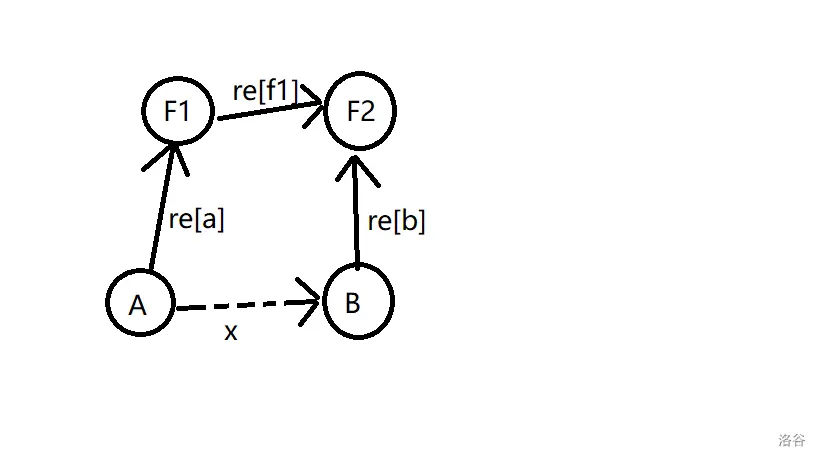
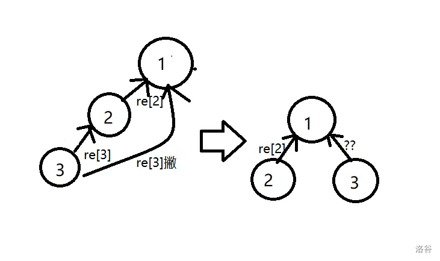
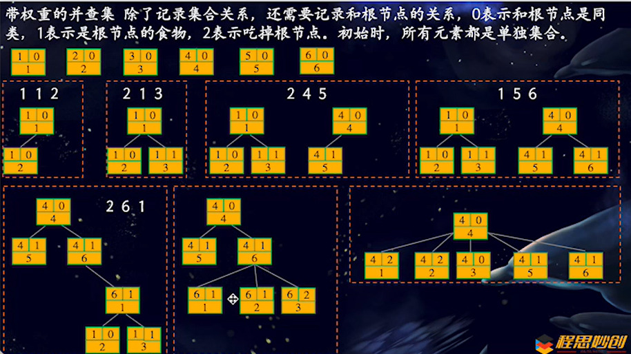
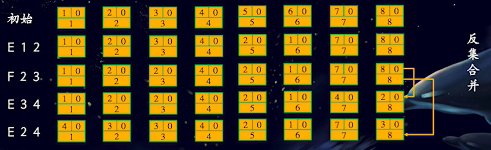
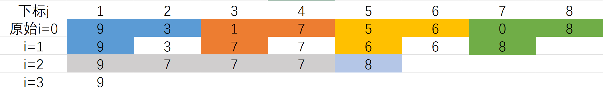
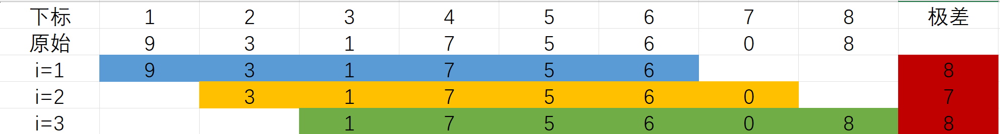
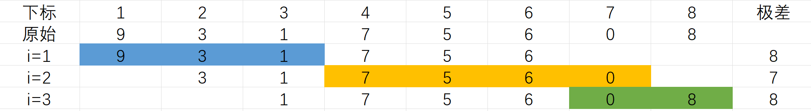
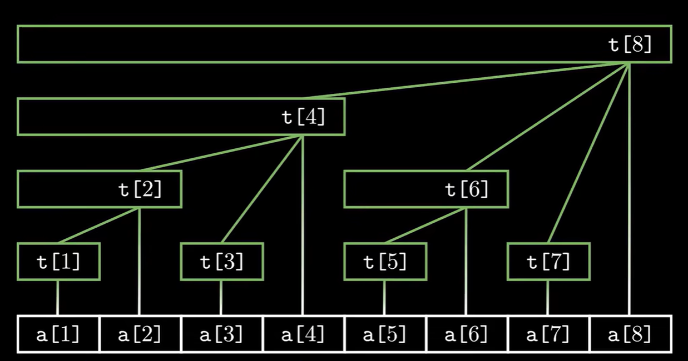

# 数据结构

## 并查集

[亲戚(模板)]([P1551 亲戚 - 洛谷 | 计算机科学教育新生态](https://www.luogu.com.cn/problem/P1551))

```c++
#include <bits/stdc++.h>
#define int long long
using namespace std;

int n, m, q;
int r1, r2, pa[5001];

int unfind(int x) { // 找根结点,状态压缩
	if(pa[x] != x) {
		pa[x] = unfind(pa[x]);
		return pa[x];
	}
	return x;
}

void solve() {
    int x, y;
    cin >> n >> m >> q;
    for(int i = 1; i <= n; i ++) pa[i] = i; // 初始化，所有结点父节点为自己
    for(int i = 1; i <= m; i ++) {
    	cin >> x >> y;
    	r1 = unfind(x);
    	r2 = unfind(y);
    	
    	if(r1 != r2) { // 合并操作
    		pa[r2] = r1;
    	}
    }
    for(int i = 0; i < q; i ++) {
    	cin >> x >> y;
    	if(unfind(x) == unfind(y)) cout << "Yes" << endl;
    	else cout << "No" << endl;
    }
}

signed main() {
    ios::sync_with_stdio(false);
    cin.tie(0);
    cout.tie(0);
    
    solve();
    return 0;
}
```

[家谱]([P2814 家谱 - 洛谷 | 计算机科学教育新生态](https://www.luogu.com.cn/problem/P2814))

```c++
#include <bits/stdc++.h>
#define int long long
using namespace std;

map<string, string> m;
string s, s1;

string unfind(string x) {
    if(m[x] != x) {
        m[x] = unfind(m[x]);
        return m[x];
    }
    return x;
}

void solve() {
    char c;
    cin >> c;
    while(c != '$') {
        cin >>s;
        if(c == '#') {
            s1 = s;
            if(m[s] == "") m[s] = s;
        }
        else if(c == '+') {
            m[s] = s1;
        }
        else
            cout << s << ' ' << unfind(s) << endl;
        cin >> c;
    }
    return ;
}

int main() {
    ios::sync_with_stdio(false);
    cin.tie(0);
    cout.tie(0);
    
    solve();
    return 0;
}
```


[集合]([P1621 集合 - 洛谷 | 计算机科学教育新生态](https://www.luogu.com.cn/problem/P1621))

```
样例分析 大于等于3小于20的质数(3, 5, 7...)
10 11 12 13 14 15 16 17 18 19 20
10 11 3  13 14 3  16 17 3  19 20	第一次
5  11 5  13 14 5  16 17 5  19 5		第二次
5  11 5  13 7  5  16 17 5  19 5     ...
```

>80分，筛法不影响

```c++
#include <bits/stdc++.h>
#define int long long
using namespace std;
const int N = 100010;

int a, b, p;
vector<int> primes, pa;
bool is_prime[N];

int unfind(int x) {
    if(pa[x] != x) {
        pa[x] = unfind(pa[x]);
        return pa[x];
    }
    return x;
}

void sieve(int n) {
    is_prime[0] = is_prime[1] = false;
    for(int i = 2; i <= n; i ++) is_prime[i] = true;
    for(int i = 2; i * i <= n; i ++) {
        if(is_prime[i]) {
            for(int j = i * i; j <= n; j += i) {
                is_prime[j] = false;
            }
        }
    }
    for(int i = 2; i <= n; i ++) {
        if(is_prime[i] && i >= p) {
            primes.push_back(i);
        } 
    }
}

void solve() {
    cin >> a >> b >> p;
    pa.resize(b + 1);

    for(int i = 1; i <= b; i ++) pa[i] = i;
    sieve(b);

    for(auto &i : primes) {
        int s = 0;
        for(int j = a; j <= b; j ++) { // 处理[a, b]范围内整数j
            if(j % i) continue; // 即j无法被任意质数i整除
            if(s == 0) {
                s = unfind(j); // 将s置为根节点
            }
            else { // 找到j根节点并合并
                int r = unfind(j);
                pa[r] = s;
            }
        }
    }

    set<int> it;
    for(int i = a; i <= b; i ++) {
        it.insert(unfind(i));
    }
    cout << it.size() << endl;
}

signed main() {
    ios::sync_with_stdio(false);
    cin.tie(0);
    cout.tie(0);
    
    solve();
    return 0;
}
```

> 优化，在筛出质数时判断

```c++
#include <bits/stdc++.h>
#define int long long
using namespace std;
const int N = 100010;

int a, b, p;
vector<int> pa;
bool is_prime[N];

int unfind(int x) {
	if(pa[x] != x) {
		pa[x] = unfind(pa[x]);
		return pa[x];
	}
	return x;
}

void sieve(int n) {
	for(int i = 2; i <= n; i ++) is_prime[i] = true;
	for(int i = 2; i <= n; i ++) {
		if(is_prime[i]) {
			for(int j = i + i; j <= n; j += i) {
				is_prime[j] = false;
				if(i >= p) {
					int r = unfind(j);
					pa[r] = i;
				}
			}
		}
	}
}

void solve() {
    cin >> a >> b >> p;
    pa.resize(b + 1);

    for(int i = 1; i <= b; i ++) pa[i] = i;
    sieve(b);
    
    set<int> it;
    for(int i = a; i <= b; i ++) {
        it.insert(unfind(i));
    }
    cout << it.size() << endl;
}

signed main() {
    ios::sync_with_stdio(false);
    cin.tie(0);
    cout.tie(0);
    
    solve();
    return 0;
}
```


###  带权重的并查集

<font color=salmon>最大的问题，就是如何在查找与合并时转移这种权值</font>

**1.合并**：并查集合并的本质就是一棵树认另一棵树做父亲，把树根相连即可，但是能否也把权值直接赋值呢（比如 1 操作就直接赋值为 1）？ **当然不行，因为给你的 a, b 是树下节点，还有考虑各自与树根的关系。** 也就说，推出 A, B各自与根的关系，就可以实现树根权值的连接了。

设 F1 与 F2 分别为 A 与 B 的根，两者权值关系为 **re[F1]**，A 与 F1 的权值关系是 **re[A]**，B 与 F2 的权值关系是 **re[B]**，A 与 B 的权值关系为 **x**



由图得，**re[f1] = x + re[b] - re[a]**

由于可能会造成 **re[b] - re[a] < 0** 的情况，所以加 **3** 再对三取模。又因为 **x** 已知为 **0** 或 **1** （要么是同种动物，要么是捕食关系），所以最终结果为：

​					**re[f1] = (re[b] - re[a] + 3) % 3**

或

​					**re[f1] = (re[b] - re[a] + 1 + 3) % 3**

**2.查找（路径压缩）**：路径压缩就是在搜索的时候找到最远的祖先，然后将父亲节点赋值，对于权值而言，就是找出权值与最远祖先之前所有边权传递的过程，找出节点与父亲节点的关系，依次传递即可

设在同一树内, 3号节点父亲是根2号, 2号父亲是根1号, 与父亲的关系分别为 **re[3]** 和 **re[2]** 路径压缩后权值为 **re[3]’**



当然，**re[3]’ = (re[3] + re[2]) mod 3**



[食物链(模板)]([P2024 [NOI2001\] 食物链 - 洛谷 | 计算机科学教育新生态](https://www.luogu.com.cn/problem/P2024))

```
权值代表着当前节点与父节点的某种关系（即使路径压缩了也是这样），通过两者关系，也可以将同一棵树下两个节点的关系表示出来。
只要确定了一种动物的种类和他们的关系（即权值），其他的动物的种类也就知道了
转移时便可以采用对 3 取模来实现
三种动物 --> 三种关系
0 --> 同种动物
1 --> 捕食关系
2 --> 天敌关系
// for(int i = 1; i <= n; i ++) {
//     unfind(i);
//     cout << i << "***" << pa[i] << "***" << re[i] << endl;
// }
```

```c++
#include<bits/stdc++.h>
#define int long long
using namespace std;

int n, m, ans = 0;
vector<int> pa, re;

int unfind(int x) {
    if(pa[x] != x) { // 权值合并＋路径压缩
        int t = pa[x];
        pa[x] = unfind(pa[x]);
        re[x] = (re[x] + re[t]) % 3;
        return pa[x];
    }
    return x;
}

void unionset(int x, int y, int t) {
    int rx = unfind(x);
    int ry = unfind(y);

    if(t == 1) {		// 同类合并
        if(rx != ry) {
        	pa[ry] = rx;
        	re[ry] = (re[x] - re[y] + 3) % 3;
        }
        else if(rx == ry && re[x] != re[y]) ans ++;
    }
    else {			// 捕食关系
    	if(rx != ry) {
    		pa[ry] = rx;
    		re[ry] = (re[x] - re[y] + 1 + 3) % 3;
    	}
    	else if(rx == ry && (re[y] - re[x]+ 3) % 3 != 1) ans ++;
    }
}

void solve() {
    int t, x, y;
    cin >> n >> m;
    pa.resize(n + 1);
    re.resize(n + 1);

    for(int i = 1; i <= n; i ++) pa[i] = i;
    for(int i = 1; i <= m; i ++) {
        cin >> t >> x >> y;
        if(t == 2 && x == y) ans ++;
        else if(x > n || y > n) ans ++;
        else unionset(x, y, t);
    }
    cout << ans << endl;
}

signed main() {
    ios::sync_with_stdio(false);
    cin.tie(0);
    cout.tie(0);
    solve();
    return 0;
}
```

[关押罪犯]([P1525 [NOIP2010 提高组\] 关押罪犯 - 洛谷 | 计算机科学教育新生态](https://www.luogu.com.cn/problem/P1525))

```c++
#include<bits/stdc++.h>
#define int long long
using namespace std;
const int N = 100010;

int n, m, f = 0;
vector<int> re, pa;

struct node {
    int x, y, t;
}num[N];

bool cmp(node x, node y) {
    return x.t > y.t;
}

int unfind(int x) {
    if(pa[x] != x) {
        int k = pa[x];
        pa[x] = unfind(pa[x]);
        re[x] = (re[x] + re[k]) % 2;
        return pa[x];
    }
    return x;
}

void unionset(int x, int y, int ans) {
    int rx = unfind(x);
    int ry = unfind(y);
    if(rx != ry) {
        pa[rx] = ry;
        re[rx] = (re[y] - re[x] + 1 + 2) % 2;
    }
    else if(rx == ry && re[x] == re[y]) {
        cout << ans << endl;
        f = 1;
        return ;
    }
}

void solve() {
    cin >> n >> m;
    re.resize(n + 1);
    pa.resize(n + 1);

    for(int i = 1; i <= n; i ++) pa[i] = i;
    for(int i = 1; i <= m; i ++) {
        int a, b, c;
        cin >> a >> b >> c;
        num[i].x = a;
        num[i].y = b;
        num[i].t = c;
    }
    sort(num + 1, num + 1 + m, cmp);
    for(int i = 1; i <= m; i ++) {
        unionset(num[i].x, num[i].y, num[i].t);
        if(f) return ;
    }
    cout << "0" << endl;
}

signed main() {
    ios::sync_with_stdio(false);
    cin.tie(0);
    cout.tie(0);
    solve();
    return 0;
}
```


### 状态压缩 + 启发式合并

```c++
#include <bits/stdc++.h>
#define int long long
using namespace std;

int n, m, q;
int r1, r2, pa[5001];
vector<int> h;
// 状态压缩(同上)
int unfind(int x) {
	if(pa[x] != x) {
		pa[x] = unfind(pa[x]);
		return pa[x];
	}
	return x;
}
// 启发式合并
void unionset(int x, int y) {
	int rx = unfind(x);
	int ry = unfind(y);
	if(rx != ry) {
		if(h[rx] < h[ry]) {
			pa[rx] = ry;
		}
		else if(h[rx] > h[ry]) {
			pa[ry] = rx;
		}
		else { // 秩相等时,任选树合并
			pa[ry] = rx;
		}
	}
}

void solve() {
    int x, y;
    h.resize(n + 1);
    cin >> n >> m >> q;
    for(int i = 1; i <= n; i ++) {
    	pa[i] = i;
    	h[i] = 0;
    }
    for(int i = 1; i <= m; i ++) {
        cin >> x >> y;
        unionset(x, y);
    }
    for(int i = 0; i < q; i ++) {
        cin >> x >> y;
        if(unfind(x) == unfind(y)) cout << "Yes" << endl;
        else cout << "No" << endl;
    }
}

signed main() {
    ios::sync_with_stdio(false);
    cin.tie(0);
    cout.tie(0);
    
    solve();
    return 0;
}
```


### 二维并查集

```
 利用 索引 将二维图存至一维
 id : (i - 1) * m + j
```

[汽车拉力比赛]([P2658 汽车拉力比赛 - 洛谷 | 计算机科学教育新生态](https://www.luogu.com.cn/problem/P2658))

```c++
#include <bits/stdc++.h>
#define int long long
using namespace std;
const int N = 501;
const int M = 250001;

int n, m, maxn, cnt;
int high[N][N], pa[M], rk[M], sign[M];
int dx[] = {1, -1, 0, 0};
int dy[] = {0, 0, 1, -1};

int unfind(int x) {
    if(pa[x] != x) {
        pa[x] = unfind(pa[x]);
        return pa[x];
    }
    return x;
}

void unionset(int x, int y) {
    int rx = unfind(x);
    int ry = unfind(y);
    if(rx != ry) {
        if(rk[rx] < rk[ry]) {
            pa[rx] = ry;
        }
        else if(rk[ry] < rk[rx]) {
            pa[ry] = rx;
        }
        else {
            pa[rx] = ry;
            rk[ry] ++;
        } 
    }
}

bool check(int x) {
    for(int i = 1; i <= n * m; i ++) pa[i] = i;
    for(int i = 1; i <= n; i ++) {
        for(int j = 1; j <= m; j ++) {
            for(int k = 0; k < 4; k ++) {
                int a = i + dx[k];
                int b = j + dy[k];
                if(a < 1 || b < 1 || a > n || b > m) continue;
                if(abs(high[i][j] - high[a][b]) > x) continue;

                unionset((i - 1) * m + j, (a - 1) * m + b);
            }
        }
    }
    for(int i = 1; i < cnt; i ++) {
        if(unfind(sign[i]) != unfind(sign[i + 1])) return false;
    }
    return true;

}

void solve() {
	cin >> n >> m;
    for(int i = 1; i <= n; i ++) {
        for(int j = 1; j <= m; j ++) {
            cin >> high[i][j];
            maxn = max(maxn, high[i][j]);
        }
    }

    for(int i = 1; i <= n; i ++) {
        for(int j = 1; j <= m; j ++) {
            int x;
            cin >> x;
            if(x == 1) {
                sign[++ cnt] = (i - 1) * m + j;
            }
        }
    }
    int l = 0, r = maxn + 1, ans = -1;
    while(l <= r) {
        int mid = l + r >> 1;
        if(check(mid)) {
            r = mid - 1;
            ans = mid;
        }
        else l = mid + 1;
    }
    cout << ans << endl;
}

signed main() {
    ios::sync_with_stdio(false);
    cin.tie(0);
    cout.tie(0);
    
    solve();
    return 0;
}
```


### 反集

[团伙]([P1892 [BOI2003\] 团伙 - 洛谷 | 计算机科学教育新生态](https://www.luogu.com.cn/problem/P1892))

```
反集 i + n 的根节点标记的是 i 的敌人
```



```c++
#include <bits/stdc++.h>
#define int long long
using namespace std;

int n, m, ans;
vector<int> pa;

int unfind(int x) {
    if(pa[x] != x) {
        pa[x] = unfind(pa[x]);
        return pa[x];
    }
    return x;
}

void unionset(int x, int y, char c) {
    int rx = unfind(x);
    int ry = unfind(y);
    if(c == 'F') {
        pa[ry] = rx;
    }
    else {
        pa[unfind(x + n)] = ry;
        pa[unfind(y + n)] = rx;
    }
}

void solve() {
	cin >> n >> m;
    pa.resize(2 * n + 1);

    for(int i = 1; i <= 2 * n; i ++) pa[i] = i;
    for(int i = 1; i <= m; i ++) {
        int x, y;
        char c;
        cin >> c >> x >> y;
        unionset(x, y, c);
    }
    for(int i = 1; i <= n; i ++) {
        if(pa[i] == i) {
            ans ++;
        }   
    }
    cout << ans << endl;
}

signed main() {
    ios::sync_with_stdio(false);
    cin.tie(0);
    cout.tie(0);
    
    solve();
    return 0;
}
```


## ST表

用于解决 **可重复贡献问题** 的数据结构

(只询问不修改)

<font color=salmon>录入快读</font>

```
解除cin cout 优化输入输出
```

```c++
#include <bits/stdc++.h>
#define int long long
using namespace std;

void solve() {
	
}

int main() {
    ios::sync_with_stdio(false);
    cin.tie(0);
    cout.tie(0);
    
    solve();
    return 0;
}
```

```
优化输入cin
```

```c
inline int read() {
    int x = 0, f = 1;
    char ch = getchar();
    while (ch < '0' || ch > '9') {
        if (ch == '-') f = -1; // 处理负数
        ch = getchar();
    }
    while (ch >= '0' && ch <= '9') {
        x = x * 10 + ch - '0'; // 将字符转换为数字
        ch = getchar();
    }
    return x * f;
}
```

<font color=salmon>模板</font>

```c
#include<bits/stdc++.h>
#define int long long
using namespace std;
const int N = 1e5;

int n, m;
int a[20][N], lg[N];

inline int read() {
    int x = 0, f = 1;
    char ch = getchar();
    while (ch < '0' || ch > '9') {
        if (ch == '-') f = -1;
        ch = getchar();
    }
    while (ch >= '0' && ch <= '9') {
        x = x * 10 + ch - '0';
        ch = getchar();
    }
    return x * f;
}

void solve() {
    n = read(), m = read();
    for(int i = 1; i <= n; i ++) a[0][i] = read();
    for(int i = 2; i <= n; i ++) lg[i] = lg[i >> 1] + 1;
    int ln = lg[n];
    for(int i = 1; i <= ln; i ++) {
        for(int j = 1; j <= n - (1 << i) + 1; j ++) {
            a[i][j] = max(a[i - 1][j], a[i - 1][j + (1 << (i-1))]);
        }
    }
    // 询问
    for(int i = 1; i <= m; i ++) {
        int x = read(), y = read();
        int len = lg[y - x + 1];
        int ans = max(a[len][x], a[len][y - (1 << len) + 1]);
        printf("%lld ", ans);
    }
}

signed main() {
    ios::sync_with_stdio(false);
    cin.tie(0);
    cout.tie(0);
    
    solve();
    return 0;
}
```




[ST 表]([P3865 【模板】ST 表 && RMQ 问题 - 洛谷](https://www.luogu.com.cn/problem/P3865))

```c++
#include <bits/stdc++.h>
#define int long long
using namespace std;
const int N = 1e5 + 10;

int n, m, a[20][N];

void solve() {
    int x, y;
    cin >> n >> m;
    for(int i = 1; i <= n; i ++) cin >> a[0][i];
    int len = log2(n);
    for(int i = 1; i <= len; i ++) {
        for(int j = 1; j <= n - (1 << i) + 1; j ++) {
            a[i][j] = max(a[i - 1][j], a[i - 1][j + (1 << (i - 1))]);
        }
    }

    for(int i = 1; i <= m; i ++) {
        cin >> x >> y;
        len = log2(y - x + 1);
        int ans = max(a[len][x], a[len][y - (1 << len) + 1]);
        cout << ans << endl;
    }
}

signed main() {
    ios::sync_with_stdio(false);
    cin.tie(0);
    cout.tie(0);
    
    solve();
    return 0;
}
```

结合快读模板再优化

```c++
#include <bits/stdc++.h>
#define int long long
using namespace std;
const int N = 1e5 +10;

int n, m, a[20][N];

inline int read() {
    int x = 0, f = 1;
    char ch = getchar();
    while (ch < '0' || ch > '9') {
        if (ch == '-') f = -1;
        ch = getchar();
    }
    while (ch >= '0' && ch <= '9') {
        x = x * 10 + ch - '0';
        ch = getchar();
    }
    return x * f;
}

void solve() {
	n = read(), m = read();
    int len = log2(n);
    for(int i = 1; i <= n; i ++) a[0][i] = read();
    for(int i = 1; i <= len; i ++) {
        for(int j = 1; j <= n - (1 << i) + 1; j ++) {
            a[i][j] = max(a[i - 1][j], a[i - 1][j + (1 << (i - 1))]);
        }
    }

    for(int i = 1; i <= m; i ++) {
        int x = read(), y = read();
        int len = log2(y - x + 1);
        int ans = max(a[len][x], a[len][y - (1 << len) + 1]);
        printf("%lld\n", ans);
    }
}

signed main() {
    ios::sync_with_stdio(false);
    cin.tie(0);
    cout.tie(0);
    
    solve();
    return 0;
}
```

[JFCA]([P7333 [JRKSJ R1\] JFCA - 洛谷](https://www.luogu.com.cn/problem/P7333))

```
1.开三倍数组空间，断环为链
2.构建ST表预处理
3.利用二分查找向前后两个方向寻找
```

```c++
#include <bits/stdc++.h>
#define int long long
using namespace std;
const int N = 1e5 + 10;

int n, a[20][3*N], lg[3*N];

inline int read() {
    int x = 0, f = 1;
    char ch = getchar();
    while (ch < '0' || ch > '9') {
        if (ch == '-') f = -1;
        ch = getchar();
    }
    while (ch >= '0' && ch <= '9') {
        x = x * 10 + ch - '0';
        ch = getchar();
    }
    return x * f;
}

int query(int x, int y) {
    int len = lg[y - x + 1];
    return max(a[len][x], a[len][y - (1 << len) + 1]);
}

int ef(int x, int i) {
    int l = 1, r = n;
    while(l < r) {
        int mid = (l + r) >> 1;
        if(max(query(i - mid, i - 1), query(i + 1, i + mid)) >= x) {
            r = mid;
        }
        else l = mid + 1;
    }
    if(l < n) return l;
    else return -1;
}

void solve() {
	n = read();
    for(int i = 1; i <= n; i ++) {
        a[0][i + 2*n] = a[0][i + n] = a[0][i] = read();
    }
    for(int i = 2; i <= 3*n; i ++){
	    lg[i] = lg[i >> 1] + 1;
	}
    int ln = lg[3*n];
    for(int i = 1; i <= ln; i ++) {
        for(int j = 1; j <= 3*n - (1 << i) + 1; j ++) {
            a[i][j] = max(a[i - 1][j], a[i - 1][j + (1 << (i-1))]);
        }
    }
    for(int i = 1; i <= n; i ++) {
        int b = read();
        printf("%lld ", ef(b, i + n));
    }
}

signed main() {
    ios::sync_with_stdio(false);
    cin.tie(0);
    cout.tie(0);
    
    solve();
    return 0;
}
```


[Choose]([P10059 Choose - 洛谷](https://www.luogu.com.cn/problem/P10059))

```
1.构建最大最小值ST表
2.L增大，最大极差呈单调不减趋势，L最大长度满足 n - k + 1
3.每次L取最大(保证最大极差)，最大区间起点从i = 1开始, 终点为n - k + i, 总共有k个这样的最大极差
4.k个最大极差中求最小值
```



```
1.在保证最大极差的情况下，求区间的最小长度
2.考虑二分，从最大区间长度n - k + 1开始二分
	l = 1, r = n - k + 1
3.满足最大极差的区间方案不唯一, 可由二分不断缩小距离
4.满足最大极差可能有多个不同方案的最小区间,需要从i=1开始遍历长度为mid的区间
```



```c++
#include <bits/stdc++.h>
#define int long long
using namespace std;
const int N = 1e5 + 10;

int n, k, t, a[20][N], b[20][N], lg[N];

inline int read() {
    int x = 0, f = 1;
    char ch = getchar();
    while (ch < '0' || ch > '9') {
        if (ch == '-') f = -1;
        ch = getchar();
    }
    while (ch >= '0' && ch <= '9') {
        x = x * 10 + ch - '0';
        ch = getchar();
    }
    return x * f;
}

int query(int x, int y) {
    int len = lg[y - x + 1];
    int maxn = max(a[len][x], a[len][y - (1 << len) + 1]);
    int minn = min(b[len][x], b[len][y - (1 << len) + 1]);
    return maxn - minn;
}

int ef(int x) {
    int l = 1, r = n - k + 1;
    while(l < r) {
        int mid = (l + r) >> 1, s = 0;
        for(int i = 1; i + mid - 1 <= n; i ++) {
            if(query(i, i + mid - 1) >= x) {
                s ++;
                if(s >= k) break;
            }
        }
        if(s >= k) r = mid;
        else l = mid + 1;
    }
    return l;
}

void solve() {
	t = read();
    while(t --) {
        n = read(), k = read();
        for(int i = 1; i <= n; i ++) a[0][i] = read();
        memcpy(b, a, sizeof a);

        for(int i = 2; i <= n; i ++) lg[i] = lg[i >> 1] + 1;
        int ln = lg[n];

        if(k == n) {
            printf("0 1\n");
            continue;
        }

        for(int i = 1; i <= ln; i ++) {
            for(int j = 1; j <= n - (1 << i) + 1; j ++) {
                a[i][j] = max(a[i - 1][j], a[i - 1][j + (1 << (i-1))]);
                b[i][j] = min(b[i - 1][j], b[i - 1][j + (1 << (i-1))]);
            }
        }

        int x = 1e18;
        for(int i = 1; i <= k; i ++) {
            x = min(x, query(i, n - k + i));
        }
        printf("%lld %lld\n", x, ef(x));
    }
}

signed main() {
    ios::sync_with_stdio(false);
    cin.tie(0);
    cout.tie(0);
    
    solve();
    return 0;
}
```


## 堆


### 二叉堆

#### 对顶堆

<font color=salmon>由两个堆（大根堆+小根堆）组合构成, 动态维护数据流的中位数/第K小元素</font>

<font color=salmon>小根堆维护大值即前`k`大的值（包含第 k 个），大根堆维护小值即比第`k`大数小的其他数</font>

<font color=salmon>模板</font>

[中位数](https://www.luogu.com.cn/problem/P1168)

```
7					输出 3 3 5 6
3 1 5 9 8 7 6   

3 --- 3
1 3 5 --- 3
1 3 5 8 9 --- 5
1 3 5 6 7 8 9 --- 6
等价于维护第k小的值
```

```c
#include<iostream>
#include<set>
using namespace std;

int n;
multiset<int> s;

void solve() {
    int x;
	cin >> n >> x;
    s.insert(x);

    auto it = s.begin();
    cout << *it << endl;
    for(int i = 2; i <= n; i ++) {
        cin >> x;
        s.insert(x);
        if(x < *it) it --;
        if(i & 1) cout << *++it << endl;
    }

}

int main() {
    ios::sync_with_stdio(false);
    cin.tie(0);
    cout.tie(0);
    
    solve();
    return 0;
}
```

```c++
#include <iostream>
#include <queue>
#include <vector>
using namespace std;
const int N = 1e5 + 10;

priority_queue<int, vector<int>, greater<int> > qs;
priority_queue<int, vector<int>, less<int> > qb;

void solve() {
    int n, x;
    cin >> n;
	for(int i = 0; i < n; i ++) {
        cin >> x;
        if(qb.empty() || x <= qb.top())
            qb.push(x);
        else
            qs.push(x);

        if(qb.size() > qs.size() + 1) {
            qs.push(qb.top());
            qb.pop();
        }
        else if(qs.size() > qb.size()) {
            qb.push(qs.top());
            qs.pop();
        }

        if((i + 1) & 1)
            cout << qb.top() << "\n";
    }

}

int main() {
    ios::sync_with_stdio(false);
    cin.tie(0);
    cout.tie(0);
    
    solve();
    return 0;
}
```

[求第k小](https://www.luogu.com.cn/problem/P1801)

```c
#include<cstdio>
#include<iostream>
#include<queue>
using namespace std;
const int N = 2e5 + 10;

int n, m;
int a[N], b[N];
priority_queue<int, vector<int> , less<int> > big;
priority_queue<int, vector<int>, greater<int> > small;

void solve() {
    cin >> n >> m;
    for(int i = 1; i <= n; i ++) cin >> a[i];
    for(int i = 1; i <= m; i ++) cin >> b[i];

    int p = 0;
    for(int i = 1; i <= m; i ++) {
        while(p < b[i]) {
            p ++;
            big.push(a[p]);
            small.push(big.top());
            big.pop();
        }
        cout << small.top() << endl;
        big.push(small.top());
        small.pop();
    }
}

int main() {
    ios::sync_with_stdio(false);
    cin.tie(0);
    cout.tie(0);

    solve();
    return 0;
}
```


## 树状数组

<font color=salmon>单点修改，区间查询模板</font>

```c++
struct FenwickTree {
    int n;
    int tree[N];
    // 计算 lowbit
    int lowbit(int k) {
        return k & -k;
    }
    // 单点更新
    int add(int x, int k) { // x表示位置，k表示值
        while(x <= n) {
            tree[x] += k;
            x += lowbit(x);
        }
    }
    // 前缀和查询
    int getsum(int x) {
        int ans = 0;
        while(x != 0) {
            ans += tree[x];
            x -= lowbit(x);
        }
        return ans;
    }
    // 区间查询
    int query(int l, int r) {
        return getsum(r) - getsum(l - 1);
    }
};
```

<font color=salmon>区间修改，单点查询模板</font>

```c++
struct FenwickTree {
    int n;
    int tree[N];
    // 计算 lowbit
    int lowbit(int x) {
        return x & -x;
    }
    // 单点更新
    int add(int x, int k) {
        while(x <= n) {
            tree[x] += k;
            x += lowbit(x);
        }
    }
    // 区间更新
    int rg_add(int l, int r, int d) {
        add(l, d);
        add(r + 1, -d);
    }
    // 单点查询(前缀和查询)
    int query(int x) {
        int ans = 0;
        while(x != 0) {
            ans += tree[x];
            x -= lowbit(x);
        }
        return ans;
    }
};
```




**<font color=salmon>前置知识</font>**

**`lowbit()`运算**

非负整数 `n` 在二进制表示下<font color=ffc30a>最低位1及其后面的0</font>构成的数值

`exp:` `lowbit(44)` = `lowbit`( (101100)<sub>2</sub>) = (100)<sub>2</sub> = 4

`lowbit(n)` = `n & (~n + 1)` = `n & -n`

- `t[x]`保存以`x`为根的子树中叶节点值的和

- `t[x]`节点的长度等于 `lowbit(x)`
- `t[x]`节点的父节点为 `t[x + lowbit(x)]`
- 整棵树的深度为 log<sub>2</sub>n + 1


树状数组 ==> 动态维护前缀和 ==> 工具

- 单点修改，区间查询
- 区间修改，单点查询
- 区间修改，区间查询


对于区间的修改, 引入差分数组d, 用树状数组维护差分数组d 前缀和, 即 a[] 每个元素增量

- 运用差分思想，将区间修改转换为两次单点修改

- 树状数组维护差分数组的前缀和

`[l, r] + d` 	即	 `add(l, d)`	`add(r + 1, -d)`

查询 `a[x]` 	`ans = a[x] + ask[x]` `(ask[x]为a[x]的增量)`


[树状数组 1 ：单点修改，区间查询](https://loj.ac/p/130)

```c
#include <iostream>
#include <vector>
#define int long long
using namespace std;

int n, m;
vector<int> tree;

inline int read() {
    int x = 0, f = 1;
    char ch = getchar();
    while (ch < '0' || ch > '9') {
        if (ch == '-') f = -1;
        ch = getchar();
    }
    while (ch >= '0' && ch <= '9') {
        x = x * 10 + ch - '0';
        ch = getchar();
    }
    return x * f;
}

int lowbit(int x) {
    return x & -x;
}

void add(int x, int k) {
    while(x <= n) {
        tree[x] += k;
        x += lowbit(x);
    }
}

int getsum(int x) {
    int ans = 0;
    while(x != 0) {
        ans += tree[x];
        x -= lowbit(x);
    }
    return ans;
}

void solve() {
    n = read(), m = read();
    tree.resize(n + 2);
    for(int i = 1; i <= n; i ++) {
        int x;
        x = read();
        add(i, x);
    }
    for(int i = 1; i <= m; i ++) {
        int ty, x, y;
        ty = read(), x = read(), y = read();
        if(ty == 1)
            add(x, y);
        if(ty == 2)
            cout << getsum(y) - getsum(x - 1) << "\n"; 
    }
}

signed main() {
    ios::sync_with_stdio(false);
    cin.tie(0);
    cout.tie(0);
    solve();
    return 0;
}
```

[树状数组 2 ：区间修改，单点查询](https://loj.ac/p/131)

```c
#include <iostream>
#include <vector>
#include <cstdio>
using namespace std;
const int N = 5e5 + 10;

int n, m;
vector<int> tree, a;

inline int read() {
    int x = 0, f = 1;
    char ch = getchar();
    while (ch < '0' || ch > '9') {
        if (ch == '-') f = -1; // 处理负数
        ch = getchar();
    }
    while (ch >= '0' && ch <= '9') {
        x = x * 10 + ch - '0'; // 将字符转换为数字
        ch = getchar();
    }
    return x * f;
}

int lowbit(int x) {
    return x & -x;
}

void add(int x, int k) {
    while(x <= n) {
        tree[x] += k;
        x += lowbit(x);
    }
}

void rg_add(int l, int r, int d) {
    add(l, d);
    add(r + 1, -d);
}

int query(int x) {
    int ans = 0;
    while(x != 0) {
        ans += tree[x];
        x -= lowbit(x);
    }
    return ans;
}

void solve() {
	n = read(), m = read();
    tree.resize(n + 2);
    a.resize(n + 2);
    for(int i = 1; i <= n; i ++) a[i] = read();
    for(int i = 1; i <= m; i ++) {
        int ty = read();
        if(ty == 1) {
            int x, y, k;
            x = read(), y = read(), k = read();
            rg_add(x, y, k);
        }
        if(ty == 2) {
            int x = read();
            cout << query(x) + a[x] << "\n";
        }
    }
}

signed main() {
    ios::sync_with_stdio(false);
    cin.tie(0);
    cout.tie(0);
    
    solve();
    return 0;
}
```


## 线段树

<font color=salmon>模板</font>

```c++
struct SegmentTree {
    vector<int> tree, lazy, nums;
    
    void build(int p, int l, int r) {
        if(l == r) {
            tree[p] = nums[l];
            return ;
        }
        int mid = l + ((r - l) >> 1);
        build(p<<1, l, mid);	// 构建左子树
        build(p<<1|1, mid + 1, r);		// 构建右子树
        tree[p] = tree[p<<1] + tree[p<<1|1];	// 合并子节点信息
    }
    
    void push_down(int p, int l, int r) { // 区间和
        if(lazy[p]) {
            int mid = l + ((r - l) >> 1);
            // 更新左子节点
            tree[p<<1] += lazy[p] * (mid - l + 1);
            lazy[p<<1] += lazy[p];
            // 更新右子节点
            tree[p<<1|1] += lazy[p] * (r - mid); // 实际为r - (mid + 1) + 1
            lazy[p<<1|1] += lazy[p];
            // 清除当前节点标记
            lazy[p] = 0;
        }
    }
    
    void update(int p, int l, int r, int ul, int ur, int val) {
        // 当前区间与更新区间无交集
        if(ur < l || ul > r) return ;
        // 当前区间完全被更新区间包含
        if(ul <= l && ur >= r) {
            tree[p] += val * (r - l + 1);
            lazy[p] += val;
            return ;
        }
        // 需要分裂更新时处理延迟标记
        push_down(p, l, r);
        int mid = l + ((r - l) >> 1);
        update(p<<1, l, mid, ul, ur, val);
        update(p<<1|1, mid + 1, r, ul, ur, val);
        tree[p] = tree[p<<1] + tree[p<<1|1];
    }
    
    int query(int p, int l, int r, int ql, int qr) {
        if(qr < l || ql > r) return 0;
        if(ql <= l && qr >= r) return tree[p];
        push_down(p, l, r);
        int mid = l + ((r - l) >> 1);
        return query(p<<1, l, mid, ql, qr) + 
               query(p<<1|1, mid + 1, r, ql, qr);
    }
}
```


[线段树](https://www.luogu.com.cn/problem/P3373)

```c
#include <iostream>
#include <vector>
#define int long long
using namespace std;

struct Node {
    int sum;	// 当前区间和
    int mul;	// 加法懒标记
    int add;	// 乘法懒标记
};

int n, m, mod;
vector<int> nums;
vector<Node> tree;

inline int read() {
    int x = 0, f = 1;
    char ch = getchar();
    while (!isdigit(ch)) {
        if (ch == '-') f = -1;
        ch = getchar();
    }
    while (isdigit(ch)) {
        x = x * 10 + ch - '0';
        ch = getchar();
    }
    return x * f;
}

void build(int p, int l, int r) {
    tree[p].add = 0;
    tree[p].mul = 1;
    if (l == r) {
        tree[p].sum = nums[l] % mod;
        return;
    }
    int mid = l + ((r - l) >> 1);
    build(p << 1, l, mid);
    build(p << 1 | 1, mid + 1, r);
    tree[p].sum = (tree[p<<1].sum + tree[p<<1|1].sum) % mod;
}

void push_down(int p, int l, int r) {
    int lc = p << 1, rc = p << 1 | 1;
    int mid = l + ((r - l) >> 1);

    // 处理乘法标记
    tree[lc].sum = (tree[lc].sum * tree[p].mul) % mod;
    tree[lc].mul = (tree[lc].mul * tree[p].mul) % mod;
    tree[lc].add = (tree[lc].add * tree[p].mul) % mod;

    tree[rc].sum = (tree[rc].sum * tree[p].mul) % mod;
    tree[rc].mul = (tree[rc].mul * tree[p].mul) % mod;
    tree[rc].add = (tree[rc].add * tree[p].mul) % mod;

    // 处理加法标记
    tree[lc].sum = (tree[lc].sum + tree[p].add * (mid - l + 1)) % mod;
    tree[lc].add = (tree[lc].add + tree[p].add) % mod;

    tree[rc].sum = (tree[rc].sum + tree[p].add * (r - mid)) % mod;
    tree[rc].add = (tree[rc].add + tree[p].add) % mod;

    // 重置父节点标记
    tree[p].mul = 1;
    tree[p].add = 0;
}

void update_mul(int p, int l, int r, int ul, int ur, int val) {
    if (ur < l || ul > r) return;
    if (ul <= l && r <= ur) {
        tree[p].sum = (tree[p].sum * val) % mod;
        tree[p].mul = (tree[p].mul * val) % mod;
        tree[p].add = (tree[p].add * val) % mod;
        return;
    }
    push_down(p, l, r);
    int mid = l + ((r - l) >> 1);
    update_mul(p << 1, l, mid, ul, ur, val);
    update_mul(p << 1 | 1, mid + 1, r, ul, ur, val);
    tree[p].sum = (tree[p<<1].sum + tree[p<<1|1].sum) % mod;
}

void update_add(int p, int l, int r, int ul, int ur, int val) {
    if (ur < l || ul > r) return;
    if (ul <= l && r <= ur) {
        tree[p].sum = (tree[p].sum + val * (r - l + 1)) % mod;
        tree[p].add = (tree[p].add + val) % mod;
        return;
    }
    push_down(p, l, r);
    int mid = l + ((r - l) >> 1);
    update_add(p << 1, l, mid, ul, ur, val);
    update_add(p << 1 | 1, mid + 1, r, ul, ur, val);
    tree[p].sum = (tree[p<<1].sum + tree[p<<1|1].sum) % mod;
}

int query(int p, int l, int r, int ql, int qr) {
    if (qr < l || ql > r) return 0;
    if (ql <= l && r <= qr) return tree[p].sum % mod;
    push_down(p, l, r);
    int mid = l + ((r - l) >> 1);
    return (query(p << 1, l, mid, ql, qr) + 
            query(p << 1 | 1, mid + 1, r, ql, qr)) % mod;
}

void solve() {
    n = read(), m = read(), mod = read();
    nums.resize(n + 1);
    tree.resize(4 * n + 10);
    for (int i = 1; i <= n; i++) nums[i] = read();

    build(1, 1, n);
    while (m--) {
        int op = read(), x, y, k;
        if (op == 1) {
            x = read(), y = read(), k = read();
            update_mul(1, 1, n, x, y, k);
        } else if (op == 2) {
            x = read(), y = read(), k = read();
            update_add(1, 1, n, x, y, k);
        } else {
            x = read(), y = read();
            cout << query(1, 1, n, x, y) << "\n";
        }
    }
}

signed main() {
    ios::sync_with_stdio(false);
    cin.tie(0);
    cout.tie(0);
    solve();
    return 0;
}
```

