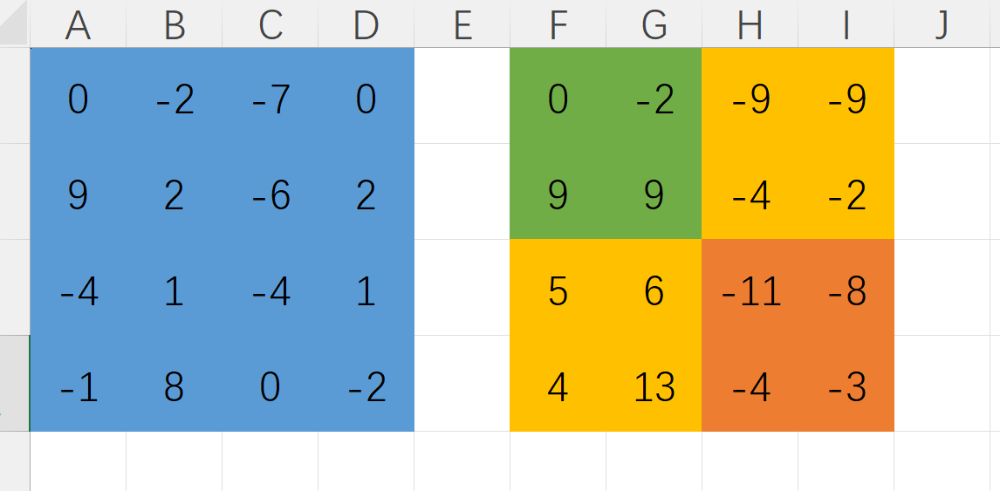
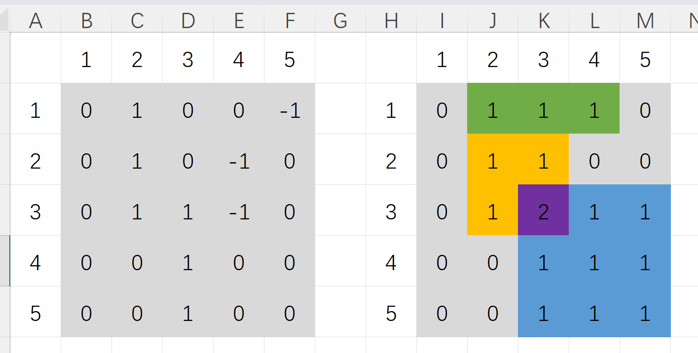

# 算法基础

## 枚举

> 递归实现排列行枚举

```c
// 按字典序输出1到n的全排列
int arr[N];
bool st[N];
void dfs(int x) {
	if(x > n) {
		for(int i = 1; i <= n; i ++) {
			cout << " " << arr[i];
		}
		cout << endl;
		return ;
	}
	for(int i = 1; i <= n; i ++) {
		if(!st[i]) {
			st[i] = true;
			arr[x] = i;
			dfs(x + 1);
			st[i] = false;
		}
	}
}
```

> 递归实现指数枚举

```c
// 从 1∼n,这n个整数中随机选取任意多个，输出所有可能的选择方案
int n;
int st[N]; // 0为未考虑，1为选，2为不选
void dfs(int x) {
	if(x > n) {
		for(int i = 1; i <= n; i ++) {
			if(st[i] == 1) {
				cout << i << " ";
			}
		}
		cout << endl;
		return ;
	}
	st[x] = 2;
	dfs(x + 1);
	st[x] = 0;
	
	st[x] = 1;
	dfs(x + 1);
	st[x] = 0;
}
```

> 递归实现组合型排列

```c
// 按字典序输出n的组合数
int n, r;
int arr[30];
void dfs(int x, int start) {
	if(x > r) {
		for(int i = 1; i <= r; i ++) {
			cout << arr[i] << " ";
		}
		cout << endl;
		return ;
	}
	for(int i = start; i <= n; i ++) {
		arr[x] = i;
		dfs(x + 1, i + 1);
	}
}
```


## 二分

<font color=DarkSeaGreen>二分模板</font>

> 整形二分

```c
bool check(int x) {} // 判断x是否满足某种性质
int r, l, ans = -1;
while(l <= r) {
	int mid = r + l >> 1;
	if(check(mid)) {
		r = mid - 1;
		ans = mid;
	}
	else l = mid + 1;
}
```

> 浮点二分

```c
bool check(int x) {} // 判断x是否满足某种性质
double r, l, ans = -1;
while(r - l > eps) { // eps 表示精度，取决于题目对精度的要求
	double mid = (l + r) / 2;
	if(check(mid)) {
		r = mid;
	}
	else l = mid;
}
ans = l;
```

[浮点二分]([P1024 [NOIP2001 提高组\] 一元三次方程求解 - 洛谷 | 计算机科学教育新生态](https://www.luogu.com.cn/problem/P1024))

```c
#include <bits/stdc++.h>
#define int long long
using namespace std;
const double eps = 1e-4;

double a, b, c, d;

double cal(double x) {
	return a * pow(x, 3) + b * pow(x, 2) + c * x + d;
}

double check(double l, double mid) {
	double x1 = cal(l);
	double x2 = cal(mid);
	if(x1 * x2 < 0) return true;
	return false;
}

double efen(double l, double r) {
	while(r - l > eps) {
		double mid = (l + r) / 2;
		if(check(l, mid)) {
			r = mid;
		}
		else l = mid;
	}
	return l;
}

void solve() {
    scanf("%d%d%d%d", &a, &b, &c, &d);
    for(int i = -100; i <= 100; i ++) {
    	double x1 = cal(i);
    	double x2 = cal(i + 1 - eps);
    	
    	if(efen(x1) < eps) {
    		printf("%.2lf ", (double)i);
    	}
    	else if(x1 * x2 < 0) {
    		printf("%.2lf", efen(i, i + 1));
    	}
    }
    printf("\n");
}

signed main() {
    ios::sync_with_stdio(false);
    cin.tie(0);
    cout.tie(0);
    
    solve();
    return 0;
}
```

[砍树]([P1873 [COCI 2011/2012 #5\] EKO / 砍树 - 洛谷 | 计算机科学教育新生态](https://www.luogu.com.cn/problem/P1873))

```c
#include <bits/stdc++.h>
#define int long long
using namespace std;
const int N = 1000010;

int n, m, tree[N];

bool check(int x) {
	int sum = 0;
	for(int i = 0; i < n; i ++) {
		if(tree[i] > x) {
			sum += tree[i] - x;
		}
		if(sum >= m) return true;
	}
	return false;
}
// 没有等号会wa几个点
void solve() {
    cin >> n >> m;
    for(int i = 0; i < n; i ++) cin >> tree[i];
    
    int l = 0, r = 4e5, ans = -1;
    while(l <= r) {
    	int mid = l + r >> 1;
    	if(check(mid)) {
    		l = mid + 1;
    		ans = mid;
    	}
    	else r = mid - 1;
    }
    cout << ans << endl;
}

signed main() {
    ios::sync_with_stdio(false);
    cin.tie(0);
    cout.tie(0);
    
    solve();
    return 0;
}
```

[木材加工]([P2440 木材加工 - 洛谷 | 计算机科学教育新生态](https://www.luogu.com.cn/problem/P2440))

```c
#include <bits/stdc++.h>
#define int long long
using namespace std;
const int N = 1e5;

int n, m, sum, maxn, a[N];

bool check(int x) {
    int sum = 0;
    for(int i = 1; i <= n; i ++) {
        sum += a[i] / x;
    }
    if(sum >= m) return true;
    else return false;
}

void solve() {
	cin >> n >> m;
    for(int i = 1; i <= n; i ++) {
        cin >> a[i];
        sum += a[i];
        if(a[i] > maxn) {
            maxn = a[i];
        }
    }
    if(sum < m) {
        cout << "0";
        return ;
    }

    int l = 1, r = maxn, ans = -1;
    while(l <= r) {
        int mid = l + r >> 1;
        if(check(mid)) {
            l = mid + 1;
            ans = mid;
        }
        else r = mid - 1;
    }
    cout << ans << endl;
}

signed main() {
    ios::sync_with_stdio(false);
    cin.tie(0);
    cout.tie(0);
    
    solve();
    return 0;
}
```

[路标设置]([P3853 [TJOI2007\] 路标设置 - 洛谷 | 计算机科学教育新生态](https://www.luogu.com.cn/problem/P3853))

```c
#include <bits/stdc++.h>
#define int long long
using namespace std;
const int N = 100010;

int d, n, k, arr[N];

bool check(int x) {
    int cnt = 0;
    for(int i = 1; i <= n; i ++) {
        cnt += (arr[i] - arr[i - 1] - 1) / x;
    }
    cnt += (d - arr[n] - 1) / x;
    return cnt <= k;
}

void solve() {
	cin >> d >> n >> k;
    for(int i = 1; i <= n; i ++) cin >> arr[i];

    int l = 1, r = 1e9, ans = -1;
    while(l <= r) {
        int mid = (l + r) / 2;
        if(check(mid)) {
            r = mid - 1;
            ans = mid;
        }
        else l = mid + 1;
    }
    cout << ans;
}

signed main() {
    ios::sync_with_stdio(false);
    cin.tie(0);
    cout.tie(0);
    
    solve();
    return 0;
}
```

[跳石头]([P2678 [NOIP2015 提高组\] 跳石头 - 洛谷 | 计算机科学教育新生态](https://www.luogu.com.cn/problem/P2678))

```c
#include <bits/stdc++.h>
#define int long long
using namespace std;
const int N = 50010;

int n, m, len, arr[N];

bool check(int x) {
    int cnt = 0;
    int i = 0;
    int now = 0;
    while(i < n + 1) {
        i ++;
        if(arr[i] - arr[now] < x) cnt ++;
        else now = i;
    }
    if(cnt > m) return false;
    else return true;
}

void solve() {
	cin >> len >> n >> m;
    for(int i = 1; i <= n; i ++) cin >> arr[i];
    arr[n + 1] = len;

    int l = 1, r = len, ans = -1;
    while(l <= r) {
        int mid = l + r >> 1;
        if(check(mid)) {
            l = mid + 1;
            ans = mid;
        }
        else r = mid - 1;
    }
    if(ans == -1) cout << "NO FOUND!";
    else cout << ans;
}

signed main() {
    ios::sync_with_stdio(false);
    cin.tie(0);
    cout.tie(0);
    
    solve();
    return 0;
}
```


## 贪心

> <font color=Salmon>(STL)优先队列priority_queue</font>
>
> 本质为<font color=navy>堆，是一种二叉堆</font>
>
> <font color=HotPink>less<>返回最大值，greater<>返回最小值</font>

[合并果子([堆]priority_queue)]([P1090 [NOIP2004 提高组\] 合并果子 / [USACO06NOV] Fence Repair G - 洛谷 | 计算机科学教育新生态](https://www.luogu.com.cn/problem/P1090))

```c
#include <bits/stdc++.h>
#define int long long
using namespace std;
const int N = 10010;

int n, k, sum = 0;
int a[N], b[N];
priority_queue<int, vector<int>, greater<int> > q;

void solve() {
    cin >> n;
    for(int i = 1; i <= n; i ++) {
    	cin >> k;
    	q.push(k);
    }
    while(q.size() >= 2) {
    	int a = q.top(); q.pop();
    	int b = q.top(); q.pop();
    	sum += a + b;
    	q.push(a + b);
    }
    cout << sum << endl;
}

signed main() {
    ios::sync_with_stdio(false);
    cin.tie(0);
    cout.tie(0);
    
    solve();
    return 0;
}
```

[删数问题]([P1106 删数问题 - 洛谷 | 计算机科学教育新生态](https://www.luogu.com.cn/problem/P1106))

```c
#include <bits/stdc++.h>
#define int long long
using namespace std;

void solve() {
    string s;
    int k, i;
    cin >> s >> k;
    
    while(k --) {
    	i = 0;
    	while(i < s.size() - 1 && s[i] <= s[i + 1]) {
    		i ++;
    	}
    	s.erase(i, 1);
    }
    while(s[0] == '0' && s.size() > 1) {
    	s.erase(0, 1);
    }
    cout << s << endl;
}

signed main() {
    ios::sync_with_stdio(false);
    cin.tie(0);
    cout.tie(0);
    
    solve();
    return 0;
}
```

## STL

[木材仓库]([P5250 【深基17.例5】木材仓库 - 洛谷 | 计算机科学教育新生态](https://www.luogu.com.cn/problem/P5250))

```c
#include <bits/stdc++.h>
#define int long long
using namespace std;

int t, n, m;
set<int> v;

void solve() {
    cin >> t;
    for(int i = 1; i <= t; i ++) {
        cin >> n >> m;
        auto it = v.find(m);
        if(n == 1) {
            if(it == v.end()) {
                v.insert(m);
            }
            else {
                cout << "Already Exist" << endl;
            }
        }
        if(n == 2) {
            if(v.empty()) {
                cout << "Empty" << endl;
            }
            else if(it != v.end()) {
                cout << *it << endl;
                v.erase(it);
            }
            else {
                auto itup = upper_bound(v.begin(), v.end(), m);
                if(itup == v.end()) {
                    cout << * --itup << endl;
                    v.erase(itup);
                }
                else if(itup == v.begin()) {
                    cout << *itup << endl;
                    v.erase(itup);
                }
                else {
                    itup --;
                    it = itup ++;
                    if(m - *it <= *itup - m) {
                        cout << *it << endl;
                        v.erase(it);
                    }
                    else {
                        cout << *itup << endl;
                        v.erase(itup);
                    }
                }
            }
        }
    }
}

signed main() {
    ios::sync_with_stdio(false);
    cin.tie(0);
    cout.tie(0);
    
    solve();
    return 0;
}
```


## 前缀和

<font color=salmon>模板</font>

```c
// 一维
void solve() {
    cin >> n >> m;
    for(int i = 1; i <= n; i ++) {
        cin >> a[i];
        a[i] += a[i - 1];
    }
    while(m --) {
        int l, r;
        cin >> l >> r;
        cout << a[r] - a[l - 1] << "\n";
    }
}

// 二维
void solve() {
    cin >> n >> m >> q;
    for(int i = 1; i <= n; i ++) {
        for(int j = 1; j <= m; j ++) {
            cin >> a[i][j];
            a[i][j] += a[i - 1][j] + a[i][j - 1] - a[i - 1][j - 1];
        }
    }
    
    while(q --) {
        int x1, y1, x2, y2, ans;
        cin >> x1 >> y1 >> x2 >> y2;
        ans = a[x2][y2] - a[x2][y1 - 1] - a[x1 - 1][y2] + a[x1 - 1][y1 - 1];
        cout << ans << "\n";
    }
}
```


<font color=salmon>二维前缀和</font>

[最大加权矩形]([P1719 最大加权矩形 - 洛谷 | 计算机科学教育新生态](https://www.luogu.com.cn/problem/P1719))



```c
#include <bits/stdc++.h>
#define int long long
using namespace std;
const int N = 130;

int n, maxn, g[N][N];

void solve() {
	cin >> n;
    for(int i = 1; i <= n; i ++) {
        for(int j = 1; j <= n; j ++) {
            cin >> g[i][j];
        }
    }

    for(int i = 1; i <= n; i ++) {
        for(int j = 1; j <= n; j ++) {
            g[i][j] += g[i - 1][j] + g[i][j - 1] - g[i - 1][j - 1];
        }
    }

    for(int a = 1; a <= n; a ++) {
        for(int b = 1; b <= n; b ++) {
            for(int i = a; i <= n; i ++) {
                for(int j = b; j <= n; j ++) {
                    int s = g[i][j] - g[a - 1][j] - g[i][b - 1] + g[a - 1][b - 1];
                    maxn = max(maxn, s);
                }
            }
        }
    }
    cout << maxn << endl;
}

signed main() {
    ios::sync_with_stdio(false);
    cin.tie(0);
    cout.tie(0);
    
    solve();
    return 0;
}
```

[聪明的质监员]([P1314 [NOIP 2011 提高组\] 聪明的质监员 - 洛谷 | 计算机科学教育新生态](https://www.luogu.com.cn/problem/P1314))

```c
#include <bits/stdc++.h>
#define int long long
using namespace std;
const int N = 200010;

int n, m, s, minn = 1e18;
int a[N][2], q[N][2], z[N][2];

int cal(int w, int n, int m) {
    int sum = 0;
    memset(z, 0, sizeof z);
    for(int i = 1; i <= n; i ++) {
        if(a[i][0] >= w) {
            z[i][0] = z[i - 1][0] + 1;
            z[i][1] = z[i - 1][1] + a[i][1];
        }
        else {
            z[i][0] = z[i - 1][0];
            z[i][1] = z[i - 1][1];
        }
    }
    for(int i = 1; i <= m; i ++) {
            int x = q[i][0];
            int y = q[i][1];
            sum += (z[y][0] - z[x - 1][0]) * (z[y][1] - z[x - 1][1]);
        }
    return sum;
}

void solve() {
	cin >> n >> m >> s;
    for(int i = 1; i <= n; i ++) cin >> a[i][0] >> a[i][1];
    for(int i = 1; i <= m; i ++) cin >> q[i][0] >> q[i][1];

    int l = 0, r = 1e6;
    while(l <= r) {
        int w = (l + r) >> 1;
        int y = 0;
        y = cal(w, n, m);
        int ans = y - s;
        if(ans == 0) {
            minn = 0;
            break;
        }
        else if(ans > 0) l = w + 1;
        else r = w - 1;
        if(minn > abs(ans)) minn = abs(ans);
    }
    cout << minn << endl;
}

signed main() {
    ios::sync_with_stdio(false);
    cin.tie(0);
    cout.tie(0);
    
    solve();
    return 0;
}
```


## 差分

<font color=salmon>模板</font>

```c
// 一维
int a[N], b[N];

void solve() {
    cin >> n >> m;
    for(int i = 1; i <= n; i ++) {
        cin >> a[i];
        b[i] = a[i] - a[i - 1];
    }
    
    while(m --) {
        int l, r, c;
        cin >> l >> r >> c;
        b[l] += c;
        b[r + 1] -= c;
    }
    
    for(int i = 1; i <= n; i ++) {
        a[i] = b[i] + a[i - 1];
        cout << a[i] << " ";
    }
}

// 二维
int a[N][N], b[N][N];

void solve() {
    cin >> n >> m >> q;
    for(int i = 1; i <= n; i ++) {
        for(int j = 1; j <= m; j ++) {
            cin >> a[i][j];
            b[i][j] = a[i][j] - a[i - 1][j] - a[i][j - 1] + a[i - 1][j - 1];
        }
    }
    
    while(q --) {
        int x1, x2, y1, y2, c;
        cin >> x1 >> y1 >> x2 >> y2 >> c;
        b[x1][y1] += c;
        b[x1][y2 + 1] -= c;
        b[x2 + 1][y1] -= c;
        b[x2 + 1][y2 + 1] += c;
    }
    
    for(int i = 1; i <= n; i ++) {
        for(int j = 1; j <= m; j ++) {
            a[i][j] = b[i][j] + a[i - 1][j] + a[i][j - 1] - a[i - 1][j - 1];
            cout << a[i][j] << " ";
        }
        cout << "\n";
    }
}
```


[语文成绩]([P2367 语文成绩 - 洛谷 | 计算机科学教育新生态](https://www.luogu.com.cn/problem/P2367))

```
样例				   原始数组：1 1 1 1 1
5 3					差分数组1：1 0 0 -1 0 
1 1 1 1 1			差分数组2：2 0 0 -1 -1
1 3 1				差分数组3：2 2 0 -1 -1 -2
1 4 1				结果数组： 3 5 5 4 3
2 5 2

a[i]为原始数组，b[i]为差分数组
结果数组计算：
x += b[i] , a[i] += x;
```

```c
#include <bits/stdc++.h>
#define int long long
using namespace std;
const int N = 5e6 + 10;

int n, m, ans = 1e18;
int a[N], b[N];

void solve() {
    cin >> n >> m;
    for(int i = 1; i <= n; i ++) cin >> a[i];
    for(int i = 1; i <= m; i ++) {
        int x, y, z;
        cin >> x >> y >> z;
        b[x] += z, b[y + 1] += -z;
    }
    int x = 0;
    for(int i = 1; i <= n; i ++) {
        x += b[i];
        a[i] += x;
        ans = min(ans, a[i]);
    }
    cout << ans << endl;
}

signed main() {
    ios::sync_with_stdio(false);
    cin.tie(0);
    cout.tie(0);
    
    solve();
    return 0;
}
```


<font color=salmon>二维差分</font>



[地毯]([P3397 地毯 - 洛谷 | 计算机科学教育新生态](https://www.luogu.com.cn/problem/P3397))

```
#include <bits/stdc++.h>
#define int long long
using namespace std;
const int N = 1100;

int n, m;
int g[N][N], a[N][N];

void solve() {
	cin >> n >> m;
    for(int i = 1; i <= m; i ++) {
        int x1, x2, y1, y2;
        cin >> x1 >> y1 >> x2 >> y2;
        for(int i = x1; i <= x2; i ++) {
            a[i][y1] += 1;
            a[i][y2 + 1] -= 1;
        }
    }
    int x = 0;
    for(int i = 0; i <= n + 1; i ++) {
        for(int j = 0; j <= n + 1; j ++) {
            x += a[i][j];
            g[i][j] += x;
        }
    }
    for(int i = 1; i <= n; i ++) {
        for(int j = 1; j <= n; j ++) {
            cout << g[i][j] << " ";
        }
        cout << endl;
    }
}

signed main() {
    ios::sync_with_stdio(false);
    cin.tie(0);
    cout.tie(0);
    
    solve();
    return 0;
}
```

[IncDec Sequence]([P4552 [Poetize6\] IncDec Sequence - 洛谷 | 计算机科学教育新生态](https://www.luogu.com.cn/problem/P4552))

1.定义

定义一个差分数组*S*和一个原数组*A*。

- 特别的：

	​				**S[1] = A[1]**

- 接下来每个数都定义为:

	​				**S[i] = A[i] - A[i - 1]**

2.性质

差分数组的性质

- 差分数组的前缀和数组就等于原数组

	​				**Sum[i] = A[i] = S[i] + Sum[i - 1]**

- *Sum*数组的差分数也等于原数组

​					**S[i] = A[I] = Sum[i] - Sum[i - 1]**

* <font color=red>最重要的</font>

	对于原数组 **A[i]** 的某段区间 **[l, r]** 进行 **加减n** 时

	差分数组

	加n时：	**S[l] += n, S[l + r] -= n**

	减n时：	**S[l] -= n, S[l + r] += n**

```
取x，y分别为差分数组正数，负数之和
操作分为两部分，先正负抵消，剩下最后一个数，再把这个数递减(增)到0
因此操作次数为max(x, y);

经过若干次操作，差分数组S = {0, 0, ..., 0, x - y};
对于差分数组中不变的 d
取值范围从 d - neg 至 d + pos
每一个可能d值都代表着一次经过若干次差分的方案
因此可能的结果为 abs(x - y) + 1
```

```
差分数组的构造可以是
b[i] = a[i] - a[i - 1]   // 从i = 2开始, b[1] = a[1], i <= n
b[i] = a[i + 1] - a[i]   // 从i = 1开始， i < n
b[i] = a[i - 1] - a[i]   // 从i = 2开始, i <= n
```

```
#include <bits/stdc++.h>
#define int long long
using namespace std;
const int N = 1e5 + 10;

int n, x, y, ans;
int a[N], b[N];

void solve() {
	cin >> n;
    for(int i = 1; i <= n; i ++) cin >> a[i];
    for(int i = 2; i <= n; i ++) {
        b[i] = a[i - 1] - a[i];
        if(b[i] < 0) {
            x += abs(b[i]);
        }
        else {
            y += abs(b[i]);
        }
        ans = max(x, y);
    }
    cout << ans << endl << abs(x - y) + 1 << endl;
}

signed main() {
    ios::sync_with_stdio(false);
    cin.tie(0);
    cout.tie(0);
    
    solve();
    return 0;
}
```

[借教室]([P1083 [NOIP 2012 提高组\] 借教室 - 洛谷 | 计算机科学教育新生态](https://www.luogu.com.cn/problem/P1083#submit))

```
#include <bits/stdc++.h>
#define int long long
using namespace std;
const int N = 1e6 + 10;

int n, m;
int a[N], b[N], c[N][3];

bool check() {
    int x = 0;
    for(int i = 1; i <= n; i ++) {
        x += b[i];
        if(a[i] < x) return false;
    }
    return true;
}

void cal(int x) {
    for(int i = 1; i <= x; i ++) {
        b[c[i][1]] += c[i][0];
        b[c[i][2] + 1] -= c[i][0];
    }
}

void solve() {
	cin >> n >> m;
    for(int i = 1; i <= n; i ++) cin >> a[i];
    for(int i = 1; i <= m; i ++) {
        cin >> c[i][0] >> c[i][1] >> c[i][2];
        b[c[i][1]] += c[i][0];
        b[c[i][2] + 1] -= c[i][0];
    }
    if(check()) {
        cout << "0";
        return ;
    }

    int l = 1, r = m;
    while(l <= r) {
        memset(b, 0, sizeof(b));
        int mid = (r + l) >> 1;
        // cout << "mid=" << mid << endl;
        cal(mid);
        if(check()) {
            l = mid + 1;
        }
        else r = mid - 1;
    }
    cout << "-1" << endl << l << endl;
}

signed main() {
    ios::sync_with_stdio(false);
    cin.tie(0);
    cout.tie(0);
    
    solve();
    return 0;
}
```

