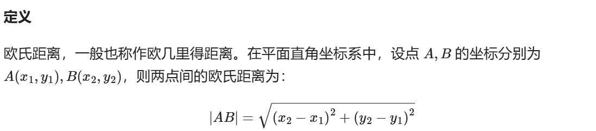
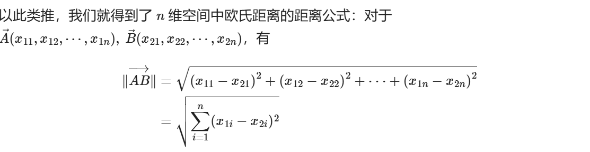

# 距离

## 欧氏几何

## 曼哈顿距离

# 坐标

## 坐标转换

### 笛卡尔坐标和数组坐标的转换

**方法一** 

适用于已知图像高度且单点转换

**笛卡尔坐标 (x, y)转数组坐标 (i, j)**

1. **j 的计算** 

	- 数组坐标的 j 轴与笛卡尔坐标的 x 轴方向一致，因此：

		​					**j = x** 

2. **i 的计算**

	- 数组坐标的 i 轴与笛卡尔坐标的 y 轴方向相反。

	- 笛卡尔坐标系的原点在左下角，而数组坐标系的原点在左上角，因此需要将 y 值翻转并偏移。

		​				**i = H - y - 1**

		- *H* 是图像的高度。
		- −1 是因为数组索引从 0 开始。

**综上所述**

- **左上角数组坐标**：**(i1, j1) = (H - y1 - 1, x1)**
- **右下角数组坐标**：**(i2, j2) = (H - y2 - 1, x2)**

​					**(i, j) = (H - y - 1, x)**

**如果索引从 1 开始**

- **左上角数组坐标**：**(i1, j1) = (H - y1, x1 + 1)**
- **右下角数组坐标**：**(i2, j2) = (H - y2, x2 + 1)**

​					**(i, j) = (H - y, x + 1)**

**方法二**

- 已知矩形的左上角笛卡尔坐标为 (x1, y1)。
- 已知矩形的右下角笛卡尔坐标为 (x2, y2)。
- 需要将这两个坐标转换为数组坐标 (i1, j1) 和 (i2, j2)。
- 高度未知，原点位置可变，且坐标字母可以相互表示。

// 推导太麻烦

**结论**

- **左上角数组坐标**：

	​		**(i1, j1) = (0, 0)**

- **右下角数组坐标**：

	​		**(i2, j2) = (y1 - y2, x2- x1)**

**通常平移后**

​	**(i1, j1) = (y2, x1)**

​	**(i2, j2) = (y1, x2)**

